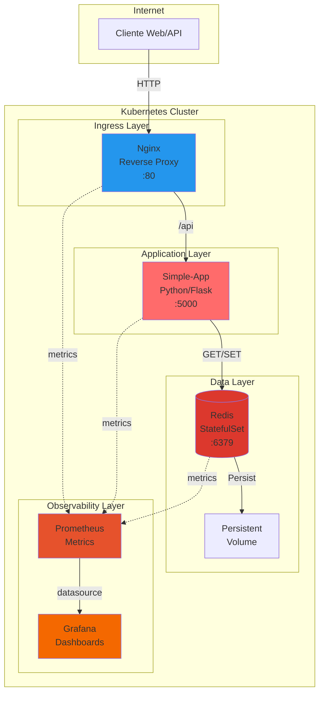

# GSX-Practica2: Cloud Native Infrastructure Project


---

## 📋 Descripción General

Este repositorio contiene la implementación completa de un proyecto de infraestructura cloud-native que evoluciona progresivamente desde contenedores básicos hasta un sistema de microservicios orquestado con Kubernetes, aprovisionado con Infrastructure as Code (Terraform), asegurado con políticas de red y monitoreado con Prometheus y Grafana.

El proyecto demuestra competencias en:
- ✅ Containerización con Docker
- ✅ Orquestación multi-contenedor con Docker Compose
- ✅ Gestión de clusters con Kubernetes
- ✅ Infraestructura como Código (IaC) con Terraform
- ✅ Seguridad de red con NetworkPolicies
- ✅ Observabilidad con Prometheus & Grafana
- ✅ Operación y troubleshooting de sistemas distribuidos

---

## 🏗️ Arquitectura del Sistema



### Flujo de Tráfico

1. **Cliente** → Solicitud HTTP al puerto 80
2. **Nginx** → Enruta `/api/*` hacia el backend
3. **Simple-App** → Procesa la solicitud y actualiza contador en Redis
4. **Redis** → Persiste datos en volumen persistente
5. **Prometheus** → Recolecta métricas de todos los componentes
6. **Grafana** → Visualiza métricas en dashboards

---

## 📂 Estructura del Proyecto

```text
GSX-Practica2/
├── weeks/
│   ├── week-08-docker/          # Contenedores básicos con Docker
│   │   ├── nginx/
│   │   ├── simple-app/
│   │   └── README.md
│   │
│   ├── week-09-compose/         # Orquestación multi-contenedor
│   │   ├── docker-compose/
│   │   │   ├── nginx/
│   │   │   ├── simple-app/
│   │   │   ├── docker-compose.yml
│   │   │   └── .env.example
│   │   └── README.md
│   │
│   ├── week-10-k8s/             # Kubernetes: Deployments, Services, ConfigMaps
│   │   ├── kubernetes/
│   │   │   ├── 00-configmap-simple-app.yml
│   │   │   ├── 01-simple-app-deployment.yml
│   │   │   ├── 02-simple-app-service.yml
│   │   │   ├── 03-redis-statefulset.yml
│   │   │   ├── 04-redis-service.yml
│   │   │   ├── 05-redis-pv.yml
│   │   │   ├── 06-redis-pvc.yml
│   │   │   ├── 07-configmap-nginx.yml
│   │   │   ├── 08-nginx-service.yml
│   │   │   └── 10-nginx-deployment.yml
│   │   └── README.md
│   │
│   ├── week-11-iac/             # Infrastructure as Code con Terraform
│   │   ├── terraform/
│   │   │   ├── environments/
│   │   │   ├── main.tf
│   │   │   ├── variables.tf
│   │   │   └── outputs.tf
│   │   ├── docker/
│   │   └── README.md
│   │
│   ├── week-12-network/         # Seguridad de red con NetworkPolicies
│   │   ├── kubernetes/
│   │   │   ├── networkpolicy-nginx.yml
│   │   │   ├── networkpolicy-app.yml
│   │   │   └── networkpolicy-redis.yml
│   │   └── README.md
│   │
│   └── week-13-final/           # Integración, documentación y entrega
│       ├── ARCHITECTURE.md
│       ├── RUNBOOK_week13.md
│       ├── TROUBLESHOOTING.md
│       ├── CIDR_PLAN.md
│       ├── INTERVIEW_PREP.md
│       ├── reflection_GaizkaAlonsoMartinez.md
│       ├── verify_integration.py
│       └── README.md
│
├── week-13-challenge-a/         # Challenge A: Observabilidad (Prometheus & Grafana)
│   ├── grafana-deployment.yml
│   ├── prometheus-deployment.yml
│   ├── deploy-all.sh
│   ├── test-observability.sh
│   ├── README_ChallengeA.md
│   └── QUICKSTART.md
│
└── README_GENERAL.md            # ← Este documento
```

---

## 🎯 Resumen por Semanas

### Week 8: Docker Basics
**Objetivo:** Crear y ejecutar contenedores Docker individuales

- 📦 Construcción de imágenes Docker para Nginx y Simple-App
- 🔧 Configuración de `Dockerfile` con mejores prácticas
- 🚀 Ejecución de contenedores individuales
- 📝 Gestión básica de imágenes y contenedores

📖 [README Week 8](weeks/week-08-docker/README.md)

---

### Week 9: Docker Compose
**Objetivo:** Orquestar múltiples contenedores con Docker Compose

- 🐳 Stack multi-contenedor: Nginx + Simple-App + Redis
- 🔗 Comunicación entre servicios por nombre DNS
- 💾 Volúmenes para persistencia de datos (Redis)
- 🌐 Redes personalizadas y variables de entorno
- 🏥 Health checks y políticas de reinicio
- ⚙️ Límites de recursos y logging

📖 [README Week 9](weeks/week-09-compose/README.md)

---

### Week 10: Kubernetes Orchestration
**Objetivo:** Migrar el stack a Kubernetes con orquestación avanzada

**Nivel Básico:**
- 📋 Deployments para Nginx y Simple-App
- 🌐 Services (ClusterIP, NodePort) para exposición
- ⚙️ ConfigMaps para configuración externalizada

**Nivel Intermedio:**
- 📊 Resource limits y requests (CPU/Memoria)
- 🏥 Readiness y liveness probes

**Nivel Avanzado:**
- 💾 PersistentVolume y PersistentVolumeClaim
- 🔄 StatefulSet para Redis con persistencia

📖 [README Week 10](weeks/week-10-k8s/README.md)

---

### Week 11: Infrastructure as Code (IaC)
**Objetivo:** Provisionar infraestructura con Terraform

- 🏗️ Definición declarativa de recursos Docker
- 📝 Módulos Terraform reutilizables
- 🔄 Gestión del estado (terraform.tfstate)
- 🌍 Múltiples entornos (dev/staging/prod)
- 🎯 Variables y outputs parametrizados

📖 [README Week 11](weeks/week-11-iac/README.md)

---

### Week 12: Network Security
**Objetivo:** Implementar seguridad de red con NetworkPolicies

- 🔒 NetworkPolicies para cada servicio
- 🚫 Bloqueo de tráfico no autorizado (deny-all por defecto)
- ✅ Permitir solo tráfico necesario:
  - `nginx` → puede recibir tráfico externo
  - `simple-app` → solo desde `nginx`
  - `redis` → solo desde `simple-app`
- 🌐 Egress rules para DNS y comunicación externa

📖 [README Week 12](weeks/week-12-network/README.md)

---

### Week 13: Final Integration
**Objetivo:** Documentación completa, integración y entrega final

**Challenge A: Observabilidad** (Prometheus & Grafana)
- 📊 Despliegue de Prometheus para métricas
- 📈 Dashboards en Grafana
- 🚨 Alertas configuradas (Error Rate, CPU, Memoria)
- 📡 Exporters para Nginx y Redis

**Challenge B: CIDR Planning**
- 📋 Plan de direccionamiento IP
- 🌐 Segmentación de redes

**Challenge C: Documentación Técnica**
- 📖 ARCHITECTURE.md (flujo, componentes, diagramas)
- 📗 RUNBOOK_week13.md (operaciones, despliegue, rollback)
- 🛠️ TROUBLESHOOTING.md (problemas comunes y soluciones)
- ✅ verify_integration.py (tests automatizados)

**Challenge D: Reflexión e Interview Prep**
- 📝 Ensayo de reflexión personal (500-1000 palabras)
- 🎤 Preparación para entrevista técnica
- 💡 Defensa de decisiones técnicas

📖 [README Week 13](weeks/week-13-final/README.md)  
📖 [README Challenge A](week-13-challenge-a/README_ChallengeA.md)

---

## 🛠️ Stack Tecnológico

### Infraestructura
- **Docker** (v20+) - Containerización
- **Docker Compose** (v2.0+) - Orquestación local
- **Kubernetes** (v1.28+) / **Minikube** - Orquestación en cluster
- **Terraform** (v1.5+) - Infrastructure as Code

### Aplicaciones
- **Nginx** (v1.25) - Reverse proxy / Ingress
- **Python/Flask** (v3.11) - Backend API
- **Redis** (v7.0) - Base de datos en memoria

### Observabilidad
- **Prometheus** (v2.45+) - Recolección de métricas
- **Grafana** (v10.0+) - Visualización y dashboards
- **Nginx Prometheus Exporter** - Métricas de Nginx
- **Redis Exporter** - Métricas de Redis

### Seguridad
- **Kubernetes NetworkPolicies** - Segmentación de red
- **Resource Limits** - Control de recursos
- **Health Checks** - Detección de fallos

---

## 🚀 Guía de Inicio Rápido

### Prerequisitos

```bash
# Verificar instalaciones
docker --version
docker-compose --version
kubectl version --client
minikube version
terraform --version
```

Si falta alguna herramienta:
- **Docker**: https://docs.docker.com/get-docker/
- **Minikube**: https://minikube.sigs.k8s.io/docs/start/
- **kubectl**: https://kubernetes.io/docs/tasks/tools/
- **Terraform**: https://developer.hashicorp.com/terraform/downloads

### Ejecutar Week 9 (Docker Compose)

```bash
cd weeks/week-09-compose/docker-compose
cp .env.example .env
docker-compose up --build
# Acceder a http://localhost:8080
```

### Ejecutar Week 10 (Kubernetes)

```bash
# Iniciar Minikube
minikube start

# Aplicar manifiestos
cd weeks/week-10-k8s/kubernetes
kubectl apply -f .

# Verificar despliegue
kubectl get pods
kubectl get svc

# Acceder a la aplicación
minikube service nginx-service
```

### Ejecutar Week 13 - Challenge A (Observabilidad)

```bash
cd week-13-challenge-a
./deploy-all.sh

# Acceder a Prometheus
echo "http://$(minikube ip):30090"

# Acceder a Grafana (admin/admin)
echo "http://$(minikube ip):30300"
```

---

## 📚 Comandos Útiles

### Docker Compose

```bash
# Levantar servicios
docker-compose up -d

# Ver logs
docker-compose logs -f simple-app

# Escalar servicio
docker-compose up -d --scale simple-app=3

# Detener todo
docker-compose down
```

### Kubernetes

```bash
# Aplicar manifiestos
kubectl apply -f kubernetes/

# Ver estado de pods
kubectl get pods -o wide

# Ver logs de un pod
kubectl logs -f <pod-name>

# Escalar deployment
kubectl scale deployment simple-app --replicas=3

# Port-forward para testing
kubectl port-forward svc/nginx-service 8080:80

# Eliminar recursos
kubectl delete -f kubernetes/
```

### Minikube

```bash
# Iniciar cluster
minikube start

# Ver IP del cluster
minikube ip

# Abrir dashboard
minikube dashboard

# Cargar imagen local
minikube image load <imagen>:tag

# Detener cluster
minikube stop
```

### Prometheus & Grafana

```bash
# Ver métricas de Prometheus
curl http://$(minikube ip):30090/metrics

# Test de conectividad Grafana
curl http://$(minikube ip):30300/api/health
```

---

## 🧪 Verificación y Testing

### Week 10 - Verificar Kubernetes

```bash
cd weeks/week-10-k8s
python3 verify_week10.py
```

### Week 13 - Verificar Integración Completa

```bash
cd weeks/week-13-final
python3 verify_integration.py
```

### Challenge A - Verificar Observabilidad

```bash
cd week-13-challenge-a
./test-observability.sh
```

---

## 🔍 Troubleshooting

### Problemas Comunes

| Problema | Solución |
|----------|----------|
| `kubectl: command not found` | Instalar kubectl: `minikube kubectl --` o instalar standalone |
| `ImagePullBackOff` en Pods | Cargar imagen en Minikube: `minikube image load imagen:tag` |
| Redis pierde datos al reiniciar | Verificar PersistentVolume: `kubectl get pv,pvc` |
| NetworkPolicy bloquea todo | Verificar labels de pods: `kubectl get pods --show-labels` |
| Grafana no muestra métricas | Verificar datasource de Prometheus en Grafana |

📖 **Guía completa:** [TROUBLESHOOTING.md](weeks/week-13-final/TROUBLESHOOTING.md)

---

## 📖 Documentación Completa

### Documentos Principales

- 📘 [ARCHITECTURE.md](weeks/week-13-final/ARCHITECTURE.md) - Arquitectura completa del sistema
- 📗 [RUNBOOK_week13.md](weeks/week-13-final/RUNBOOK_week13.md) - Guía operativa
- 🛠️ [TROUBLESHOOTING.md](weeks/week-13-final/TROUBLESHOOTING.md) - Resolución de problemas
- 🌐 [CIDR_PLAN.md](weeks/week-13-final/CIDR_PLAN.md) - Plan de direccionamiento de red
- 🎤 [INTERVIEW_PREP.md](weeks/week-13-final/INTERVIEW_PREP.md) - Preparación para entrevistas

### Reflexión Personal

- 📝 [reflection_GaizkaAlonsoMartinez.md](weeks/week-13-final/reflection_GaizkaAlonsoMartinez.md) - Ensayo de reflexión sobre el proyecto

---

## 📄 Licencia

Este proyecto es parte de un trabajo académico para el curso GSX-Practica2.
