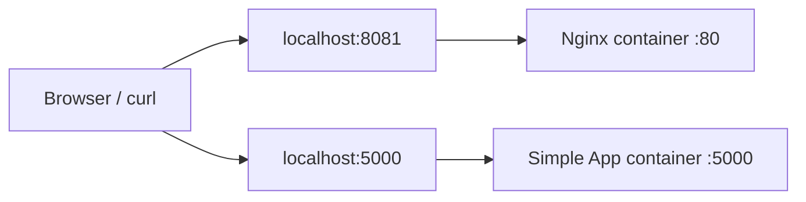

# Week 8: Containerization (Docker)

This week packages two independent GreenDevCorp services as Docker images:

- `nginx/`: an Nginx web server based on `nginx:latest`.
- `simple-app/`: a minimal Python HTTP server.

The objective is to make both applications reproducible: build the image, run the container, test it locally, push it to Docker Hub, and explain the security and optimization choices.

## 1. Architecture

The following diagram shows how the two Week 8 containers are used during local validation. Unlike Week 9 and Week 10, they are tested independently rather than as a connected multi-service stack.



## 2. Basic Deliverable

### Nginx Container

The Nginx image serves a small static page from `/usr/share/nginx/html`.

There was no real Assignment 1 website content in this repository, so `index.html` is a minimal repository-controlled page used to demonstrate that `curl localhost` returns our own site content instead of relying only on the default Nginx welcome page.

Dockerfile choices:

- **Base image**: `nginx:latest`, as required by the assignment.
- **Custom config**: `default.conf` replaces the default server block.
- **Static content**: `index.html` is copied into the Nginx document root.
- **Runtime user**: the container runs as the built-in non-root `nginx` user.
- **Healthcheck**: Docker checks that Nginx answers HTTP requests.
- **Port**: the image exposes port `80`.

Build and test from the repository root:

```bash
cd weeks/week-08-docker
docker build -t nginx-gsx ./nginx
docker run -d -p 8081:80 --name nginx-server nginx-gsx
```

Check status:

```bash
docker ps --filter name=nginx-server
```

Expected result:

```text
nginx-server ... Up ... (healthy) ... 0.0.0.0:8081->80/tcp
```

Check HTTP status:

```bash
curl.exe -sS -I http://localhost:8081/
```

Expected result:

```text
HTTP/1.1 200 OK
```

Check page content:

```bash
curl.exe -sS http://localhost:8081/
```

Expected result: the HTML response contains:

```html
<h1>GreenDevCorp Nginx Container</h1>
```

Clean up:

```bash
docker rm -f nginx-server
```

The assignment example uses `-p 80:80`. For local demonstrations, `8081:80` avoids conflicts with other services. If host port `80` is free, this also works:

```bash
docker run -d -p 80:80 --name nginx-server nginx-gsx
curl.exe http://localhost/
docker rm -f nginx-server
```

### Simple App Container

The simple app is a small Python HTTP server with two routes:

- `/`: returns `Hello from container` by default.
- `/health`: returns `OK`.

It uses Python's standard library, so there are no external application dependencies.

Dockerfile choices:

- **Base image**: `python:3.12-alpine`, chosen because it is small and already includes Python.
- **Application runtime**: Python standard library `http.server`.
- **Working directory**: `/app`.
- **Runtime user**: a dedicated non-root `app` user runs the process.
- **Configuration**: `PORT` and `APP_MESSAGE` are read from environment variables.
- **Healthcheck**: Docker checks `/health`.
- **Port**: the image exposes port `5000`.

Build and test from the repository root:

```bash
cd weeks/week-08-docker
docker build -t simple-app-gsx ./simple-app
docker run -d -p 5000:5000 --name simple-app-server simple-app-gsx
```

Check status:

```bash
docker ps --filter name=simple-app-server
```

Expected result:

```text
simple-app-server ... Up ... (healthy) ... 0.0.0.0:5000->5000/tcp
```

Check the main route:

```bash
curl.exe -sS http://localhost:5000/
```

Expected result:

```text
Hello from container
```

Check the health endpoint:

```bash
curl.exe -sS -i http://localhost:5000/health
```

Expected result:

```text
HTTP/1.0 200 OK
...
OK
```

Check environment-based configuration:

```bash
docker rm -f simple-app-server
docker run -d -p 5000:5000 --name simple-app-server -e APP_MESSAGE="Hello from env" simple-app-gsx
curl.exe -sS http://localhost:5000/
```

Expected result:

```text
Hello from env
```

Clean up:

```bash
docker rm -f simple-app-server
```

## 3. Docker Hub

Published tags:

- `alvaropcaballer/nginx-gsx:v1`
- `alvaropcaballer/simple-app-gsx:v1`

Commands used to tag and push:

```bash
docker login
docker tag nginx-gsx:latest alvaropcaballer/nginx-gsx:v1
docker tag simple-app-gsx:latest alvaropcaballer/simple-app-gsx:v1
docker push alvaropcaballer/nginx-gsx:v1
docker push alvaropcaballer/simple-app-gsx:v1
```

Latest pushed digests:

```text
alvaropcaballer/nginx-gsx:v1       sha256:a882978dec8c7bb8c743433595633cb829d97cb7153ae4044833b6e34dda0091
alvaropcaballer/simple-app-gsx:v1  sha256:90a1bce6b96a3590d0b7dca3af35d61f2f9efb0fc3c2bb112644f63afae71a7f
```

Verification from another machine, or after removing the local images:

```bash
docker pull alvaropcaballer/nginx-gsx:v1
docker pull alvaropcaballer/simple-app-gsx:v1

docker run -d -p 8081:80 --name nginx-server alvaropcaballer/nginx-gsx:v1
curl.exe -sS http://localhost:8081/
docker rm -f nginx-server

docker run -d -p 5000:5000 --name simple-app-server alvaropcaballer/simple-app-gsx:v1
curl.exe -sS http://localhost:5000/
curl.exe -sS http://localhost:5000/health
docker rm -f simple-app-server
```

## 4. Intermediate Optimizations

### Image Size

Measured with:

```bash
docker image ls nginx-gsx --format "{{.Repository}} {{.Tag}} {{.Size}}"
docker image ls simple-app-gsx --format "{{.Repository}} {{.Tag}} {{.Size}}"
```

Current results:

```text
nginx-gsx latest 237MB
simple-app-gsx latest 74.3MB
```

### Layer Optimization

The Dockerfiles keep stable layers before frequently changed application files:

- Nginx copies only `default.conf` and `index.html`.
- Simple app creates the user before copying `app.py`.
- Simple app has no package installation layer because it uses only Python's standard library.

### Ownership Optimization

Both Dockerfiles copy application files with the final runtime owner:

```dockerfile
COPY --chown=nginx:nginx ...
COPY --chown=app:app ...
```

This avoids unnecessary ownership changes after copying files.

### Multistage Build Decision

Multistage builds were considered but not used because neither image has a build phase:

- Nginx only serves static files.
- The Python app has no compiled artifacts and no external dependencies.

Using a multistage build here would add complexity without reducing the final runtime content.

## 5. Advanced Security

### Vulnerability Scanning

Docker Scout is available in Docker Desktop, but it required an explicit Docker ID login in this environment. To complete the vulnerability scan without installing host tools, Trivy was executed as a temporary container.

Commands used:

```bash
docker run --rm -v /var/run/docker.sock:/var/run/docker.sock aquasec/trivy:latest image --severity HIGH,CRITICAL --exit-code 0 nginx-gsx:latest
docker run --rm -v /var/run/docker.sock:/var/run/docker.sock aquasec/trivy:latest image --severity HIGH,CRITICAL --exit-code 0 simple-app-gsx:latest
```

Scan results:

```text
nginx-gsx:latest      12 HIGH, 0 CRITICAL
simple-app-gsx:latest 0 HIGH,  0 CRITICAL
```

The Nginx findings come from Debian packages included in the required `nginx:latest` base image. A production alternative would be to test `nginx:alpine` or pin a specific patched Nginx tag, but this assignment explicitly requires `nginx:latest`.

### Hardened Runtime

Both images can run with a read-only root filesystem, dropped Linux capabilities, and `no-new-privileges`.

Hardened Nginx:

```bash
docker run -d -p 8081:80 --name nginx-server `
  --read-only `
  --tmpfs /var/cache/nginx:rw,noexec,nosuid,size=16m,uid=101,gid=101 `
  --tmpfs /var/run:rw,noexec,nosuid,size=4m,uid=101,gid=101 `
  --tmpfs /run:rw,noexec,nosuid,size=4m,uid=101,gid=101 `
  --cap-drop=ALL `
  --cap-add=NET_BIND_SERVICE `
  --security-opt=no-new-privileges `
  nginx-gsx
```

Nginx needs `CAP_NET_BIND_SERVICE` because the container listens on privileged port `80`. The writable tmpfs mounts are limited to the runtime paths Nginx needs.

Hardened simple app:

```bash
docker run -d -p 5000:5000 --name simple-app-server `
  --read-only `
  --cap-drop=ALL `
  --security-opt=no-new-privileges `
  simple-app-gsx
```

Verification:

```bash
curl.exe -sS -I http://localhost:8081/
curl.exe -sS http://localhost:5000/
curl.exe -sS http://localhost:5000/health
docker ps --filter name=nginx-server --filter name=simple-app-server
```

Expected results:

```text
HTTP/1.1 200 OK
Hello from container
OK
nginx-server ... (healthy)
simple-app-server ... (healthy)
```

Security inspection:

```bash
docker inspect --format "{{.Name}} ReadonlyRootfs={{.HostConfig.ReadonlyRootfs}} CapDrop={{.HostConfig.CapDrop}} CapAdd={{.HostConfig.CapAdd}} SecurityOpt={{.HostConfig.SecurityOpt}}" nginx-server
docker inspect --format "{{.Name}} ReadonlyRootfs={{.HostConfig.ReadonlyRootfs}} CapDrop={{.HostConfig.CapDrop}} CapAdd={{.HostConfig.CapAdd}} SecurityOpt={{.HostConfig.SecurityOpt}}" simple-app-server
```

Observed results:

```text
/nginx-server ReadonlyRootfs=true CapDrop=[ALL] CapAdd=[CAP_NET_BIND_SERVICE] SecurityOpt=[no-new-privileges]
/simple-app-server ReadonlyRootfs=true CapDrop=[ALL] CapAdd=[] SecurityOpt=[no-new-privileges]
```

Clean up:

```bash
docker rm -f nginx-server simple-app-server
```

### Security Notes

- Containers are not virtual machines; they share the host kernel, so least privilege matters.
- Running as non-root limits the impact of an application-level compromise.
- `--read-only` reduces the ability to modify the filesystem at runtime.
- `--cap-drop=ALL` removes default Linux capabilities that the process does not need.
- `--security-opt=no-new-privileges` prevents privilege escalation through setuid or similar mechanisms.
- Rootless Docker is another hardening option because the Docker daemon and containers run without host root privileges. It improves isolation, but it is an environment-level setup rather than something encoded in this repository.

## 6. Docker Ignore Strategy

Each build context has its own `.dockerignore`:

- `nginx/.dockerignore`
- `simple-app/.dockerignore`

Docker only reads the `.dockerignore` file inside the active build context. For example, `docker build ./simple-app` uses `simple-app/.dockerignore`.

The simple app ignores Python cache files, virtual environments, Git metadata, and local placeholder files. The Nginx context ignores Git metadata.

## 7. Deliverables Checklist

### Basic

- [x] Dockerfile for Nginx application
- [x] Dockerfile for simple application
- [x] Nginx uses `nginx:latest`
- [x] Simple app responds to HTTP requests
- [x] Both images build locally
- [x] Both containers run independently
- [x] `curl` verification documented
- [x] Both images pushed to Docker Hub and verified
- [x] Dockerfile choices documented

### Intermediate

- [x] Small Alpine base used for the Python app
- [x] No unnecessary Python dependencies
- [x] Layer order kept simple and cache-friendly
- [x] File ownership handled with `COPY --chown`
- [x] Non-root users used in both containers
- [x] Image sizes measured and documented
- [x] Multistage build decision documented

### Advanced

- [x] Images scanned for HIGH/CRITICAL vulnerabilities
- [x] Scan results documented
- [x] Read-only root filesystem tested
- [x] Linux capabilities minimized
- [x] `no-new-privileges` tested
- [x] Rootless container alternative documented
