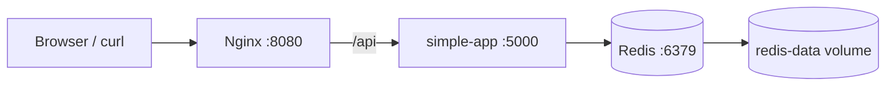

# Week 9: Multi-Container Orchestration (Docker Compose)

This week connects and extends the Week 8 containers into a small multi-service stack managed with Docker Compose.

The goal of this week is to run multiple containers together, make them communicate by service name, centralize configuration with environment variables, persist data with volumes, and improve reliability using health checks, dependencies, restart policies, custom networks, logging limits, and resource limits.

The stack includes:

- `nginx`: public entry point and reverse proxy.
- `simple-app`: Python backend service.
- `redis`: persistent data store for the backend visit counter.

## 1. Project Structure

```text
week-09-compose/
├── docker-compose/
│   ├── nginx/
│   │   ├── default.conf
│   │   └── Dockerfile
│   ├── simple-app/
│   │   ├── app.py
│   │   ├── Dockerfile
│   │   └── requirements.txt
│   ├── .env
│   ├── .env.example
│   └── docker-compose.yml
└── README.md
```

The `docker-compose.yml` file is located inside the `docker-compose/` directory. Therefore, the build contexts are relative to that directory:

- `./nginx`
- `./simple-app`

The `.env` file is used locally but is ignored by Git. Only `.env.example` is committed as a safe configuration template.

## 2. Architecture

The following diagram illustrates how the containers interact. It is written in Mermaid and renders correctly on GitHub:



### Traffic Flow

1. A client sends a request to `http://localhost:8080`.
2. Nginx receives the request as the public entry point.
3. Requests to `/api` are forwarded by Nginx to `simple-app`.
4. `simple-app` connects to Redis using the service name `redis`.
5. Redis stores the visit counter in a persistent volume.

### Network Design

All services are attached to the custom bridge network `gsx-network`.

This gives us:

- **Service discovery**: containers can reach each other by service name.
- **Isolation**: the stack is separated from unrelated containers.
- **Cleaner configuration**: Nginx proxies to `http://simple-app:5000/` instead of using fixed IP addresses.

## 3. Services

### `nginx`

`nginx` is the public entry point of the stack.

Responsibilities:

- Exposes port `8080` on the host and port `80` inside the container.
- Serves static content through the default Nginx document root.
- Proxies `/api` requests to the backend service.
- Waits for `simple-app` to become healthy before starting.
- Provides a health check so Docker Compose can verify that Nginx is responding to HTTP traffic.

Nginx is built from a Week 9 Dockerfile that uses the Week 8 `nginx-gsx` image as its base. This allows us to reuse the containerization work from Week 8 and extend it with the Compose-specific reverse proxy configuration.

The proxy configuration is defined in:

```text
docker-compose/nginx/default.conf
```

The relevant reverse proxy rule is:

```nginx
location /api {
    proxy_pass http://simple-app:5000/;
    proxy_set_header Host $host;
    proxy_set_header X-Real-IP $remote_addr;
}
```

This proves that services communicate using Docker Compose service names instead of fixed IP addresses.

### `simple-app`

`simple-app` is the backend service.

Responsibilities:

- Runs a simple Python HTTP server.
- Reads configuration from environment variables.
- Exposes the main endpoint `/`.
- Exposes the health endpoint `/health`.
- Connects to Redis to increment and read the visit counter.
- Returns a message and the current visit count.
- Waits for Redis to become healthy before starting.

The backend uses the following environment variables:

- `APP_MESSAGE`
- `PORT`
- `REDIS_HOST`
- `REDIS_PORT`

The application does not hardcode the Redis host or port. Instead, it reads them from the environment. In this stack, `REDIS_HOST=redis`, which matches the Redis service name in Docker Compose.

The backend depends on the Python Redis client, defined in:

```text
docker-compose/simple-app/requirements.txt
```

### `redis`

`redis` is the persistent data store of the stack.

Responsibilities:

- Stores the visit counter used by `simple-app`.
- Persists data to disk using Redis append-only mode.
- Mounts the `redis-data` named volume at `/data`.
- Provides a `PING`-based health check.
- Allows the backend to keep state even if containers are recreated.

Redis uses the official image:

```text
redis:7-alpine
```

The container runs with:

```bash
redis-server --appendonly yes
```

This enables append-only persistence, so Redis writes data to disk and can restore it after container recreation.

## 4. Configuration

Runtime configuration is not hardcoded in the images. Instead, Docker Compose injects values from environment files.

Local execution uses:

```text
docker-compose/.env
```

The committed template is:

```text
docker-compose/.env.example
```

Example configuration:

```env
APP_MESSAGE=Hello from Docker Compose
PORT=5000
REDIS_HOST=redis
REDIS_PORT=6379
```

The real `.env` file is ignored by Git. This avoids committing local configuration, secrets, passwords, API keys, or machine-specific values.

Using environment variables makes the stack easier to adapt to different environments without rebuilding the container images.

## 5. Volumes and Persistence

The main persistent volume of the stack is:

```text
redis-data
```

It is mounted inside the Redis container at:

```text
/data
```

It stores:

- Redis append-only files.
- The visit counter written by `simple-app`.

This means:

- `docker compose down` stops and removes containers.
- The named volume remains.
- After `docker compose up` again, the visit counter is still available.

Important:

```bash
docker compose down -v
```

removes the volumes and resets the stored data.

### Additional Application Volume

The stack also defines:

```text
app-data
```

This volume is mounted at:

```text
/data
```

inside the `simple-app` container.

The main persistence demonstration is done through Redis and `redis-data`. The `app-data` volume is kept available for application-side persistent files or future extensions.

## 6. Health Checks, Dependencies and Restart Policies

The stack uses health checks for all services.

### `redis` health check

Redis is checked with:

```bash
redis-cli ping
```

Expected result:

```text
PONG
```

This confirms that Redis is running and accepting commands.

### `simple-app` health check

The backend exposes:

```text
/health
```

Docker Compose checks this endpoint locally inside the container.

The endpoint verifies that the backend can reach Redis. If Redis is unavailable, the health check fails.

### `nginx` health check

Nginx checks local HTTP availability by requesting:

```text
http://localhost/
```

This verifies that the reverse proxy is serving HTTP traffic.

### Dependencies

The services start in a controlled order:

1. `redis` starts first.
2. `simple-app` waits until `redis` is healthy.
3. `nginx` waits until `simple-app` is healthy.

This avoids false starts where a container process is running but the service it depends on is not ready yet.

### Restart Policies

All services use:

```yaml
restart: unless-stopped
```

This means that if a container crashes unexpectedly, Docker Compose will restart it automatically unless it was manually stopped.

This improves reliability during local development.

## 7. Logging

Each service uses the `json-file` logging driver with rotation limits.

The configuration is:

```yaml
logging:
  driver: json-file
  options:
    max-size: "10m"
    max-file: "3"
```

This prevents log files from growing without limit.

The maximum log storage per service is approximately:

```text
10 MB x 3 files = 30 MB
```

This is useful because long-running containers can generate many logs, and uncontrolled log growth can consume disk space.

Logs can be inspected with:

```bash
docker compose logs
```

or limited to recent entries with:

```bash
docker compose logs --tail=50
```

## 8. Resource Limits

Each service defines CPU and memory reservations and limits.

Resource limits are important because they prevent one container from consuming all host resources. This is especially useful in multi-container environments, where several services share the same machine.

The chosen values are intentionally small because this is a local development stack.

| Service | CPU Reservation | CPU Limit | Memory Reservation | Memory Limit | Reasoning |
|---|---:|---:|---:|---:|---|
| `nginx` | `0.10` | `0.25` | `64M` | `128M` | Nginx only acts as a lightweight reverse proxy. |
| `simple-app` | `0.20` | `0.50` | `128M` | `256M` | The backend receives more resources because it runs the application logic. |
| `redis` | `0.10` | `0.25` | `64M` | `128M` | Redis only stores a small visit counter in this demo. |

The limits make the stack safer and more predictable during local execution.

They also document the expected resource usage of each service, which is useful when reasoning about scaling or moving the stack to another environment.

## 9. How to Run

### Prerequisite

Build the Week 8 base images first from the repository root.

```bash
cd weeks/week-08-docker
docker build -t nginx-gsx ./nginx
docker build -t simple-app-gsx ./simple-app
```

These images are used as the base for the Week 9 Dockerfiles.

### Start the Compose stack

Move to the Compose directory:

```bash
cd ../week-09-compose/docker-compose
```

Start the stack:

```bash
docker compose up -d --build
```

### Check running services

```bash
docker compose ps
```

Expected result:

- `nginx` is running and healthy.
- `simple-app` is running and healthy.
- `redis` is running and healthy.

### Check logs

```bash
docker compose logs --tail=50
```

This is useful to verify that the services started correctly and to debug startup errors.

## 10. How to Verify

### 10.1 Reverse Proxy Communication

Run:

```bash
curl http://localhost:8080/api
```

On Windows PowerShell, this can also be run as:

```bash
curl.exe http://localhost:8080/api
```

Expected result:

```text
Hello from Docker Compose | Visits: 1
```

The visit number may be different depending on previous requests.

This test verifies:

- The client can reach Nginx.
- Nginx can proxy requests to `simple-app`.
- `simple-app` can respond successfully.
- `simple-app` can communicate with Redis.

### 10.2 Backend to Redis Communication

Run:

```bash
docker compose exec redis redis-cli get visits
```

Expected result:

```text
1
```

or another numeric value.

This verifies that the backend is writing the visit counter to Redis.

### 10.3 Service Name Resolution

The backend reaches Redis using:

```text
redis:6379
```

Nginx reaches the backend using:

```text
simple-app:5000
```

These names match the service names defined in `docker-compose.yml`.

This verifies Docker Compose service discovery inside the custom network.

### 10.4 Persistence Test

1. Start the stack:

```bash
docker compose up -d --build
```

2. Call the application several times:

```bash
curl http://localhost:8080/api
curl http://localhost:8080/api
```

3. Check the stored value:

```bash
docker compose exec redis redis-cli get visits
```

4. Stop the stack without deleting volumes:

```bash
docker compose down
```

5. Start it again:

```bash
docker compose up -d
```

6. Check the counter again:

```bash
docker compose exec redis redis-cli get visits
```

If the value is still there, persistence works correctly.

### 10.5 Volume Reset Test

To reset the persistent data:

```bash
docker compose down -v
```

Then start again:

```bash
docker compose up -d
```

The Redis counter should be reset because the named volume was removed.

## 11. Useful Commands

Start the stack:

```bash
docker compose up -d --build
```

Stop the stack:

```bash
docker compose down
```

Stop the stack and remove volumes:

```bash
docker compose down -v
```

Show running containers:

```bash
docker compose ps
```

Show logs:

```bash
docker compose logs
```

Show recent logs:

```bash
docker compose logs --tail=50
```

Execute a command inside Redis:

```bash
docker compose exec redis redis-cli ping
```

Read the visit counter:

```bash
docker compose exec redis redis-cli get visits
```

Validate the final Compose configuration:

```bash
docker compose config
```

Rebuild without cache:

```bash
docker compose build --no-cache
```

## 12. Troubleshooting

### Problem: `nginx` is unhealthy

Possible causes:

- The Nginx configuration file has a syntax error.
- The backend is not healthy yet.
- The health check command is not available inside the image.

Useful commands:

```bash
docker compose logs nginx
docker compose exec nginx nginx -t
docker compose ps
```

The current health check uses `curl`, so make sure the Nginx image contains `curl`.

### Problem: `simple-app` is unhealthy

Possible causes:

- Redis is not available.
- Environment variables are incorrect.
- The backend cannot connect to `redis:6379`.
- The Python Redis dependency is missing.

Useful commands:

```bash
docker compose logs simple-app
docker compose exec simple-app env
docker compose exec redis redis-cli ping
```

### Problem: Redis data does not persist

Possible causes:

- The stack was stopped with `docker compose down -v`.
- The Redis volume was removed manually.
- Redis append-only mode is not enabled.
- The wrong volume is mounted.

Useful commands:

```bash
docker volume ls
docker compose exec redis redis-cli get visits
docker compose logs redis
```

### Problem: Nginx cannot reach the backend

Possible causes:

- The service name in `default.conf` is wrong.
- `simple-app` is not attached to the same network.
- `simple-app` is not healthy.
- The backend port is wrong.

Useful commands:

```bash
docker compose ps
docker compose logs nginx
docker compose logs simple-app
docker compose exec nginx wget -qO- http://simple-app:5000/
```

## 13. Compose vs Kubernetes

Docker Compose is appropriate here because this is a local development stack.

It is useful for:

- Running several containers with one command.
- Testing service communication locally.
- Managing environment variables and volumes.
- Reproducing a development environment quickly.

However, Docker Compose is not ideal for production at scale.

For production-like orchestration, Kubernetes is more appropriate because it provides:

- Automatic scaling.
- Self-healing.
- Rolling updates.
- More advanced service discovery.
- Declarative infrastructure management.
- Stronger scheduling and resource management.

In this project, Compose is used as the bridge between individual containers from Week 8 and Kubernetes orchestration in the following weeks.

## 14. Deliverables Checklist

### Basic

- [x] `docker-compose.yml` created.
- [x] 3 services defined: `nginx`, `simple-app`, and `redis`.
- [x] Services communicate by service name.
- [x] Nginx proxies `/api` requests to `simple-app`.
- [x] `simple-app` communicates with Redis.
- [x] Named volume defined for persistence.
- [x] Environment variables used through `.env`.
- [x] `.env.example` provided.
- [x] `.env` ignored by Git.
- [x] Architecture diagram documented.
- [x] Services explained.
- [x] Volumes explained.
- [x] Configuration explained.

### Intermediate

- [x] Health checks configured for all services.
- [x] `depends_on` with health conditions configured.
- [x] Restart policies configured.
- [x] Health checks and dependencies documented.

### Advanced

- [x] Custom Docker network configured.
- [x] Logging driver configured.
- [x] Log rotation configured with `max-size` and `max-file`.
- [x] Service-specific CPU limits configured.
- [x] Service-specific memory limits configured.
- [x] Resource limits documented.

### Final Verification

- [x] `docker compose up -d --build` tested.
- [x] `docker compose ps` shows all services running and healthy.
- [x] `curl http://localhost:8080/api` returns backend response.
- [x] Redis visit counter verified with `redis-cli get visits`.
- [x] Persistence verified after `docker compose down` and `docker compose up -d`.
- [x] Logs checked with `docker compose logs`.
- [x] Final configuration checked with `docker compose config`.
