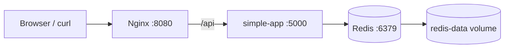

# Week 9: Multi-Container Orchestration (Docker Compose)

This week connects and extends the Week 8 containers into a small multi-service stack managed with Docker Compose. The stack includes:
- `nginx`: entry point and reverse proxy.
- `simple-app`: Python backend service.
- `redis`: persistent data store for the backend visit counter.

## 1. Architecture



### Network Design

All services are attached to the custom bridge network `gsx-network`.

This gives us:
- **Service discovery**: containers can reach each other by service name.
- **Isolation**: the stack is separated from unrelated containers.
- **Cleaner configuration**: Nginx proxies to `http://simple-app:5000/` instead of using fixed IPs.

## 2. Services

### `nginx`
- Built from a Week 9 Dockerfile that uses the Week 8 `nginx-gsx` image as its base.
- Exposes port `8080` on the host and port `80` inside the container.
- Works as the public entry point for the stack.
- Proxies `/api` requests to `simple-app`.
- Has its own health check so Compose can detect whether the reverse proxy is actually serving HTTP traffic.

### `simple-app`
- Built from a Week 9 Dockerfile that uses the Week 8 `simple-app-gsx` image as its base.
- Reads configuration from `.env`.
- Exposes a `/health` endpoint for Compose health checks.
- Stores the visit counter in Redis so state survives container recreation.
- Waits for Redis to become healthy before startup.

### `redis`
- Uses the official `redis:7-alpine` image.
- Runs with `appendonly yes` so data is written to disk.
- Mounts the named volume `redis-data` at `/data`.
- Provides persistence for the visit counter.
- Exposes a `PING`-based health check used by Compose dependency management.

## 3. Configuration

Runtime configuration is not hardcoded in the image. Instead, Compose injects values from:
- `docker-compose/.env` for local execution.
- `docker-compose/.env.example` as the template committed to Git.

Variables used by `simple-app`:
- `APP_MESSAGE`
- `PORT`
- `REDIS_HOST`
- `REDIS_PORT`

The repository root already ignores `.env`, so local secrets and machine-specific values are not committed.

## 4. Volumes and Persistence

The named volume `redis-data` is the persistent storage of the stack.

It stores:
- the Redis append-only data files
- the backend visit counter written by `simple-app`

This means:
- `docker compose down` stops and removes containers
- the named volume remains
- after `docker compose up` again, the visit counter is still there

Important:
- `docker compose down -v` removes the volume and resets the stored data

## 5. How to Run

Prerequisite: build the Week 8 base images first from the repository root:

```bash
cd weeks/week-08-docker
docker build -t nginx-gsx ./nginx
docker build -t simple-app-gsx ./simple-app
```

Then run Compose:

```bash
cd ../week-09-compose/docker-compose
docker compose up -d --build
```

Check the services:

```bash
docker compose ps
docker compose logs --tail=50
```

## 6. How to Verify

### Reverse proxy communication

```bash
curl.exe http://localhost:8080/api
```

Expected result:
- a response from `simple-app`
- the message includes the visit counter stored in Redis

### Backend to Redis communication

```bash
docker compose exec redis redis-cli get visits
```

Expected result:
- a numeric counter such as `1`, `2`, `3`, etc.

### Persistence test

1. Start the stack and call `/api` once or twice.
2. Check the stored value:

```bash
docker compose exec redis redis-cli get visits
```

3. Stop the stack without deleting volumes:

```bash
docker compose down
```

4. Start it again:

```bash
docker compose up -d
```

5. Check the counter again:

```bash
docker compose exec redis redis-cli get visits
```

If the value is still there, persistence works correctly.

## 7. Compose Features Used

- **`depends_on` with health conditions**: `simple-app` waits for `redis`, and `nginx` waits for `simple-app`. This avoids false starts where a container launches before the service it needs is actually ready.
- **`healthcheck`**: all three services define runtime checks. `nginx` validates local HTTP availability, `simple-app` validates `/health`, and `redis` validates `redis-cli ping`. This gives Compose a real readiness signal instead of relying only on process startup.
- **`restart: unless-stopped`**: if a service crashes unexpectedly during development, Compose brings it back automatically without requiring manual intervention.
- **Custom network**: `gsx-network`.
- **Named volume**: `redis-data`.
- **Logging limits**: `json-file` with rotation to avoid uncontrolled growth.

## 8. Deliverables Checklist

- [x] `docker-compose.yml` with 3 services
- [x] Services communicate by service name
- [x] Named volume defined for persistence
- [x] Environment variables used through `.env`
- [x] `.env.example` provided
- [x] Architecture diagram documented
- [x] Local execution verified with `docker compose up`
- [x] Persistence verified after `docker compose down` / `up`
