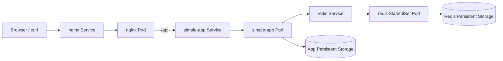

# Week 10: Container Orchestration with Kubernetes

This week migrates the multi-container stack from Docker Compose to Kubernetes.

The goal of this week is to deploy the application using Kubernetes resources, expose services correctly, manage configuration through ConfigMaps, add health checks and resource limits, and introduce persistence using Persistent Volumes, Persistent Volume Claims, and a StatefulSet.

The stack includes:

- `nginx`: public entry point and reverse proxy.
- `simple-app`: Python backend service.
- `redis`: persistent data store for the backend visit counter.

## 1. Project Structure

```text
week-10-kubernetes/
├── kubernetes/
│   ├── 00-configmap-simple-app.yml
│   ├── 01-configmap-nginx.yml
│   ├── 02-app-data-pv.yml
│   ├── 03-app-data-pvc.yml
│   ├── 04-redis-headless-service.yml
│   ├── 05-redis-service.yml
│   ├── 06-redis-statefulset.yml
│   ├── 07-simple-app-service.yml
│   ├── 08-simple-app-deployment.yml
│   ├── 09-nginx-service.yml
│   └── 10-nginx-deployment.yml
├── verify_week10.py
└── README.md
```

The Kubernetes manifests are grouped inside the `kubernetes/` directory.
The `verify_week10.py` script automates the verification steps that would otherwise require many repeated manual commands.

This structure separates configuration, networking, storage, stateless workloads, and stateful workloads in a clean and readable way.

## 2. Architecture

The following diagram shows how the application is deployed in Kubernetes:



### Traffic Flow

1. A client accesses the application through the `nginx` Service.
2. The request reaches the `nginx` Pod.
3. Requests to `/api` are forwarded to the `simple-app` Service.
4. The `simple-app` Pod processes the request.
5. The backend connects to Redis through the internal Kubernetes Service `redis`.
6. Redis stores the visit counter in persistent storage.

### Internal Communication

Services communicate using Kubernetes DNS names:

- `simple-app`
- `redis`

This avoids fixed IP addresses and keeps the configuration portable and declarative.

## 3. Main Kubernetes Resources

### `ConfigMap`

Two ConfigMaps are used in this week:

- One for backend environment variables.
- One for the Nginx reverse proxy configuration.

The backend ConfigMap defines values such as:

- `PORT`
- `APP_MESSAGE`
- `REDIS_HOST`
- `REDIS_PORT`

The Nginx ConfigMap stores the `default.conf` reverse proxy configuration.

This allows configuration to be changed without rebuilding container images.

### `Deployment`

Two Deployments are used:

- `nginx`
- `simple-app`

Deployments are appropriate for stateless services because they manage Pod creation, replacement, and scaling automatically.

Responsibilities of the Deployments:

- Keep the desired number of Pods running.
- Restart failed Pods automatically.
- Support scaling and rolling updates.
- Define container ports, probes, resource limits, and mounted configuration.

### `Service`

Three Services are used:

- `nginx` Service
- `simple-app` Service
- `redis` Service

Their purpose is:

- Expose `nginx` to the outside.
- Provide stable internal networking for the backend.
- Allow Redis to be reached by service name.

The `nginx` Service is exposed as `NodePort` so it can be reached from outside the cluster in Minikube.

The `simple-app` and `redis` Services are internal `ClusterIP` Services.

### `StatefulSet`

Redis is deployed with a StatefulSet.

This is more appropriate than a Deployment for Redis because Redis stores state and benefits from stable identity and storage association.

The StatefulSet ensures:

- Stable Pod naming.
- Stable storage assignment.
- Better support for persistent state.

## 4. Configuration

The backend configuration is injected through a ConfigMap instead of using a local `.env` file directly.

Example values:

```env
PORT=5000
APP_MESSAGE=Hello from Kubernetes
REDIS_HOST=redis
REDIS_PORT=6379
```

This matches the application code, which reads configuration from environment variables.

In this project, the application expects `PORT`, not `APP_PORT`, so the ConfigMap must define `PORT=5000`.

The Nginx reverse proxy configuration is also injected through a ConfigMap, which replaces the static Compose-based setup with a Kubernetes-native solution.

## 5. Persistence

Persistence is implemented in two places.

### Redis persistence

Redis stores data in persistent storage mounted at:

```text
/data
```

This is managed through a StatefulSet volume and ensures that the visit counter is preserved even if the Redis Pod is recreated.

### Application persistent storage

The backend also mounts persistent storage at:

```text
/data
```

This is provided through:

- one `PersistentVolume`
- one `PersistentVolumeClaim`

This demonstrates how Kubernetes separates storage definition from storage consumption.

### Why PV and PVC are needed

- The `PersistentVolume` represents real storage available to the cluster.
- The `PersistentVolumeClaim` is the request made by the application.
- The Pod uses the claim, not the volume directly.

This makes the design more flexible and closer to real Kubernetes usage.

## 6. Health Checks and Reliability

Kubernetes uses probes to verify container health.

### `simple-app` probes

The backend exposes:

```text
/health
```

This endpoint is used for:

- `readinessProbe`
- `livenessProbe`

This ensures that traffic is only sent to the backend when it is ready, and that the Pod is restarted if it becomes unhealthy.

### `nginx` probes

Nginx is checked through:

```text
/
```

This verifies that the web server is responding correctly.

### `redis` probes

Redis is checked using:

```bash
redis-cli ping
```

Expected result:

```text
PONG
```

This confirms that Redis is accepting commands.

These probes improve reliability and support Kubernetes self-healing.

## 7. Resource Limits

Resource requests and limits are configured for all major services.

These limits are important because they:

- Prevent one container from consuming all node resources.
- Document expected resource usage.
- Improve scheduling decisions.
- Make the deployment safer and more predictable.

The selected values are small because this is a learning environment and the application is lightweight.

## 8. Stateless vs Stateful Components

This week clearly separates stateless and stateful workloads.

### Stateless

- `nginx`
- `simple-app`

These are deployed with `Deployment` because they can be recreated without data loss.

### Stateful

- `redis`

Redis is deployed with `StatefulSet` because it stores data that must survive Pod recreation.

This distinction is one of the key concepts introduced in Kubernetes orchestration.

## 9. How to Run

### Prerequisites

Make sure Minikube is running:

```bash
minikube start
kubectl cluster-info
```

If the custom images are only local, load them into Minikube:

```bash
minikube image load nginx-gsx:latest
minikube image load simple-app-gsx:latest
```

### Deploy everything

From the project root:

```bash
kubectl apply -f kubernetes/
```

### Check resources

```bash
kubectl get pods
kubectl get services
kubectl get pvc
kubectl get pv
```

## 10. How to Verify

### 10.1 Check Pods

```bash
kubectl get pods
```

Expected result:

- `nginx` Pod running
- `simple-app` Pod running
- `redis-0` Pod running

### 10.2 Check Services

```bash
kubectl get services
```

Expected result:

- `nginx` exposed with `NodePort`
- `simple-app` exposed internally
- `redis` exposed internally

### 10.3 Access the application

```bash
minikube service nginx --url
```

Then call the returned URL in the browser or with curl.

This confirms that the `nginx` Service is reachable from the host machine.

In this project the `nginx` Service is still defined as `NodePort`, which is the correct Kubernetes concept to learn and validate. However, with Minikube running through the Docker driver on Windows, the Minikube node lives inside a private Docker network. That means the `NodePort` exists inside Kubernetes, but it is not always directly reachable from another laptop on the same Wi-Fi network.

For that reason, the most reliable way to access the application from the host is:

```bash
kubectl port-forward service/nginx 8080:80
```

Then open:

- `http://127.0.0.1:8080/`
- `http://127.0.0.1:8080/api/`

### 10.4 Access from another laptop on the same Wi-Fi

To demonstrate real external access from another machine, we exposed the Kubernetes Service through the Windows host itself.

The idea is:

- the other laptop connects to the Windows host IP and port `8080`
- the Windows host forwards that traffic into Kubernetes with `kubectl port-forward`
- Kubernetes sends the traffic to `service/nginx`
- `nginx` proxies `/api/` to `simple-app`

This approach does not replace the Kubernetes architecture. It only changes how the cluster is exposed to the local network in a Minikube-on-Windows environment.

Use `PowerShell`, not Git Bash, for the following commands.

1. Prepare the cluster in a normal PowerShell window:

   ```powershell
   cd "C:\Users\alvar\OneDrive\Desktop\UNI\3r_Curs\2n_quatri\GSX\Practiques\Practica2-GSX\weeks\week-10-k8s"
   "minikube start
   kubectl config current-context
   kubectl apply -f kubernetes
   kubectl rollout status deployment/simple-app --timeout=120s
   kubectl rollout status statefulset/redis --timeout=120s
   kubectl rollout restart deployment/nginx
   kubectl rollout status deployment/nginx --timeout=180s
   kubectl get pods"
   ```

2. Open the Windows firewall in an administrator PowerShell window:

   ```powershell
   New-NetFirewallRule -DisplayName "Week10 Nginx LAN 8080 Private" -Direction Inbound -Action Allow -Protocol TCP -LocalPort 8080 -Profile Private
   New-NetFirewallRule -DisplayName "Week10 Nginx LAN 8080 Public" -Direction Inbound -Action Allow -Protocol TCP -LocalPort 8080 -Profile Public
   ```

3. Publish the service to the LAN in a normal PowerShell window and keep it open:

   ```powershell
   "kubectl port-forward --address 0.0.0.0 service/nginx 8080:80"
   ```

4. Verify locally from the host:

   ```powershell
   "ipconfig
   Invoke-WebRequest http://127.0.0.1:8080/ -UseBasicParsing
   Invoke-WebRequest http://127.0.0.1:8080/api/ -UseBasicParsing"
   ```

5. From another laptop on the same Wi-Fi, open:

   ```text
   http://<HOST_WIFI_IP>:8080/
   http://<HOST_WIFI_IP>:8080/api/
   ```

Example from our test:

```text
http://10.11.48.238:8080/
http://10.11.48.238:8080/api/
```

This proves that:

- the host can reach the Kubernetes Service
- the service is published to the LAN
- the reverse proxy path `/api/` works from another machine

To stop the demonstration:

- press `Ctrl + C` in the terminal running `kubectl port-forward`
- optionally remove the firewall rules:

```powershell
Remove-NetFirewallRule -DisplayName "Week10 Nginx LAN 8080 Private"
Remove-NetFirewallRule -DisplayName "Week10 Nginx LAN 8080 Public"
```

### 10.5 Verify backend communication

```bash
kubectl exec -it deploy/nginx -- sh
wget -qO- http://simple-app:5000/
```

This verifies that Nginx can reach the backend through the Service.

### 10.6 Verify Redis communication

```bash
kubectl exec -it redis-0 -- redis-cli ping
```

Expected result:

```text
PONG
```

This verifies that Redis is running correctly.

### 10.7 Verify persistence

Write a file inside the backend persistent volume:

```bash
kubectl exec -it deploy/simple-app -- sh -c "echo hello > /data/test.txt && cat /data/test.txt"
```

Restart the backend:

```bash
kubectl rollout restart deployment simple-app
```

Read the file again:

```bash
kubectl exec -it deploy/simple-app -- sh -c "cat /data/test.txt"
```

If the file is still there, persistence works correctly.

### 10.8 Automated verification script

Because the number of checks in Week 10 is already large, the repository includes an automated verification script:

```bash
py -3 verify_week10.py
```

The script can also be launched from the repository root:

```bash
py -3 weeks/week-10-k8s/verify_week10.py
```

The script is designed as a readable test runner, not as a black box. It is divided into:

- helper routines that execute `kubectl` commands, wait for readiness, read fields with `jsonpath`, run commands inside Pods, and expose `nginx` locally through `kubectl port-forward`
- test routines that validate one concept at a time and print explicit `[PASS]` or `[FAIL]` lines

Before applying manifests, the script now performs a fast reachability check against the active `kubectl` context. If the Kubernetes API is not reachable, it stops immediately with a clear error instead of continuing into long readiness waits that would otherwise fail later.

The script does **not** depend on `minikube service --url` for HTTP checks. Instead, it uses `kubectl port-forward service/nginx ...` because that is more reliable on Windows with the Docker driver.

The script validates access from the local host. The additional LAN-access demonstration from Section `10.4` is manual because it also depends on host networking and Windows firewall configuration, which are outside Kubernetes itself.

### 10.9 What the script validates

A successful run currently contains the following test blocks:

1. `Cluster reachable`

   This checks that the active `kubectl` context can actually reach the
   Kubernetes API server before any other verification starts.

2. `Apply manifests`

   This reapplies every manifest in `kubernetes/` so the verification runs
   against the latest configuration.

3. `Resources exist`

   This checks that the expected objects were created:

   - `Deployment/nginx`
   - `Deployment/simple-app`
   - `StatefulSet/redis`
   - `Service/nginx`
   - `Service/simple-app`
   - `Service/redis`
   - `Service/redis-headless`
   - `ConfigMap/simple-app-config`
   - `ConfigMap/nginx-config`
   - `PersistentVolume/app-data-pv`
   - `PersistentVolumeClaim/app-data-pvc`

4. `Workloads ready`

   This waits until:

   - `nginx` has ready replicas
   - `simple-app` has ready replicas
   - `redis` has all StatefulSet replicas ready

5. `Configuration and service types`

   This verifies:

   - `nginx` is exposed as `NodePort`
   - `simple-app` and `redis` are `ClusterIP`
   - `redis-headless` is headless
   - the backend Pod really receives `APP_MESSAGE`, `REDIS_HOST`, and
     `REDIS_PORT` from the ConfigMap
   - the Nginx Pod really receives the reverse-proxy configuration from
     the ConfigMap

6. `Probes and resources`

   This verifies that:

   - readiness probes are configured
   - liveness probes are configured
   - CPU and memory requests are defined
   - CPU and memory limits are defined

7. `Redis ping`

   This executes `redis-cli ping` inside `redis-0` and expects `PONG`.

8. `In-cluster connectivity`

   This verifies service-name communication inside the cluster:

   - `nginx` reaches `simple-app` through `http://simple-app:5000/`
   - `simple-app` opens a TCP connection to `redis:6379`

9. `HTTP endpoints`

   This exposes `nginx` locally with `kubectl port-forward` and checks:

   - `/` returns HTTP 200
   - `/api/` reaches the backend through the reverse proxy

10. `Scaling`

   This scales `nginx` from 1 replica to 3 replicas and then back to 1
   replica, proving that Kubernetes updates the number of Pods
   automatically.

11. `Resilience`

    This deletes an `nginx` Pod and checks that the Deployment recreates
    it automatically.

12. `Persistence`

    This writes a marker file into `/data` in `simple-app`, restarts the
    Deployment, and verifies that the file still exists after the new Pod
    is ready.

13. `Redis persistence`

    This writes a Redis key, deletes `redis-0`, waits for the StatefulSet
    Pod to come back, and verifies that the Redis data is still present.

### 10.10 Interpreting the output

A passing run ends with a summary like:

```text
FINAL SUMMARY
Passed: 13
Failed: 0
```

During the run, each test prints the exact `kubectl` command being executed and a corresponding `[PASS]` line. This makes the script useful both as:

- an automatic regression check
- a traceable record of how the Week 10 stack was validated

If the cluster is unreachable or manifest application fails, the script now stops after that critical failure instead of continuing into the remaining checks with misleading follow-up errors.

### 10.11 Mapping the script to Week 10 deliverables

The script output provides direct evidence for the checklist items:

#### Core / Basic

- Kubernetes manifests created: validated by `Apply manifests`
- `nginx`, `simple-app`, and `redis` deployed: validated by `Resources exist` and `Workloads ready`
- Services communicate by service name: validated by `In-cluster connectivity`
- `ConfigMap` used for configuration: validated by `Configuration and service types`
- `Service` resources created: validated by `Resources exist`
- `Deployment` resources created: validated by `Resources exist`
- scaling tested: validated by `Scaling`
- resilience tested: validated by `Resilience`

#### Intermediate

- readiness probes configured: validated by `Probes and resources`
- liveness probes configured: validated by `Probes and resources`
- resource requests configured: validated by `Probes and resources`
- resource limits configured: validated by `Probes and resources`
- services reachable from outside and through reverse proxy: validated by `HTTP endpoints`

#### Advanced

- persistent storage configured: validated by `Resources exist`, `Persistence`, and `Redis persistence`
- `PersistentVolume` created: validated by `Resources exist`
- `PersistentVolumeClaim` created: validated by `Resources exist`
- `StatefulSet` created for Redis: validated by `Resources exist`
- StatefulSet data survives Pod recreation: validated by `Redis persistence`
- application data survives Deployment restart: validated by `Persistence`

### 10.12 LAN Demo Cheat Sheet

Use this short sequence in `PowerShell` when you want to repeat the external-access demonstration quickly.

1. Normal PowerShell:

   ```powershell
   cd "C:\Users\alvar\OneDrive\Desktop\UNI\3r_Curs\2n_quatri\GSX\Practiques\Practica2-GSX\weeks\week-10-k8s"
   minikube start
   kubectl apply -f kubernetes
   kubectl rollout status deployment/simple-app --timeout=120s
   kubectl rollout status statefulset/redis --timeout=120s
   kubectl rollout restart deployment/nginx
   kubectl rollout status deployment/nginx --timeout=180s
   kubectl port-forward --address 0.0.0.0 service/nginx 8080:80
   ```

2. Administrator PowerShell:

   ```powershell
   New-NetFirewallRule -DisplayName "Week10 Nginx LAN 8080 Private" -Direction Inbound -Action Allow -Protocol TCP -LocalPort 8080 -Profile Private
   New-NetFirewallRule -DisplayName "Week10 Nginx LAN 8080 Public" -Direction Inbound -Action Allow -Protocol TCP -LocalPort 8080 -Profile Public
   ```

3. Other laptop:

   ```text
   http://<HOST_WIFI_IP>:8080/
   http://<HOST_WIFI_IP>:8080/api/
   ```

4. Cleanup:

   - stop `kubectl port-forward` with `Ctrl + C`
   - remove the temporary firewall rules if needed

   ```powershell
   Remove-NetFirewallRule -DisplayName "Week10 Nginx LAN 8080 Private"
   Remove-NetFirewallRule -DisplayName "Week10 Nginx LAN 8080 Public"
   ```

## 11. Deliverables Checklist

The checklist below is backed by the automated verification flow described in Section 10.8 through Section 10.11.

### Basic

- [x] Kubernetes manifests created.
- [x] `nginx`, `simple-app`, and `redis` deployed.
- [x] Services communicate by service name.
- [x] `ConfigMap` used for configuration.
- [x] `Service` resources created.
- [x] `Deployment` resources created.
- [x] Architecture documented.

### Intermediate Checklist

- [x] Readiness probes configured.
- [x] Liveness probes configured.
- [x] Resource requests configured.
- [x] Resource limits configured.
- [x] Reliability and health checks documented.

### Advanced Checklist

- [x] Persistent storage configured.
- [x] `PersistentVolume` created.
- [x] `PersistentVolumeClaim` created.
- [x] `StatefulSet` created for Redis.
- [x] Stateful vs stateless design explained.
