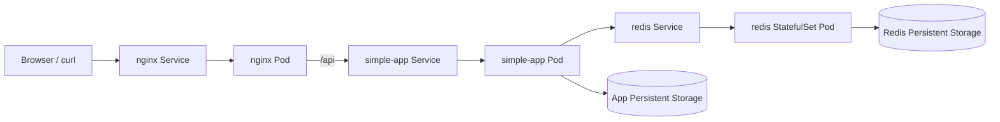

# Week 10: Container Orchestration with Kubernetes

This week migrates the multi-container stack from Docker Compose to Kubernetes.

The goal of this week is to deploy the application using Kubernetes resources, expose services correctly, manage configuration through ConfigMaps, add health checks and resource limits, and introduce persistence using Persistent Volumes, Persistent Volume Claims, and a StatefulSet.

The stack includes:

- `nginx`: public entry point and reverse proxy.
- `simple-app`: Python backend service.
- `redis`: persistent data store for the backend visit counter.

## 1. Project Structure

```text
week-10-kubernetes/
├── kubernetes/
│   ├── 00-configmap-simple-app.yml
│   ├── 01-configmap-nginx.yml
│   ├── 02-app-data-pv.yml
│   ├── 03-app-data-pvc.yml
│   ├── 04-redis-headless-service.yml
│   ├── 05-redis-service.yml
│   ├── 06-redis-statefulset.yml
│   ├── 07-simple-app-service.yml
│   ├── 08-simple-app-deployment.yml
│   ├── 09-nginx-service.yml
│   └── 10-nginx-deployment.yml
└── README.md
```

The Kubernetes manifests are grouped inside the `kubernetes/` directory.

This structure separates configuration, networking, storage, stateless workloads, and stateful workloads in a clean and readable way.

## 2. Architecture

The following diagram shows how the application is deployed in Kubernetes:



### Traffic Flow

1. A client accesses the application through the `nginx` Service.
2. The request reaches the `nginx` Pod.
3. Requests to `/api` are forwarded to the `simple-app` Service.
4. The `simple-app` Pod processes the request.
5. The backend connects to Redis through the internal Kubernetes Service `redis`.
6. Redis stores the visit counter in persistent storage.

### Internal Communication

Services communicate using Kubernetes DNS names:

- `simple-app`
- `redis`

This avoids fixed IP addresses and keeps the configuration portable and declarative.

## 3. Main Kubernetes Resources

### `ConfigMap`

Two ConfigMaps are used in this week:

- One for backend environment variables.
- One for the Nginx reverse proxy configuration.

The backend ConfigMap defines values such as:

- `PORT`
- `APP_MESSAGE`
- `REDIS_HOST`
- `REDIS_PORT`

The Nginx ConfigMap stores the `default.conf` reverse proxy configuration.

This allows configuration to be changed without rebuilding container images.

### `Deployment`

Two Deployments are used:

- `nginx`
- `simple-app`

Deployments are appropriate for stateless services because they manage Pod creation, replacement, and scaling automatically.

Responsibilities of the Deployments:

- Keep the desired number of Pods running.
- Restart failed Pods automatically.
- Support scaling and rolling updates.
- Define container ports, probes, resource limits, and mounted configuration.

### `Service`

Three Services are used:

- `nginx` Service
- `simple-app` Service
- `redis` Service

Their purpose is:

- Expose `nginx` to the outside.
- Provide stable internal networking for the backend.
- Allow Redis to be reached by service name.

The `nginx` Service is exposed as `NodePort` so it can be reached from outside the cluster in Minikube.

The `simple-app` and `redis` Services are internal `ClusterIP` Services.

### `StatefulSet`

Redis is deployed with a StatefulSet.

This is more appropriate than a Deployment for Redis because Redis stores state and benefits from stable identity and storage association.

The StatefulSet ensures:

- Stable Pod naming.
- Stable storage assignment.
- Better support for persistent state.

## 4. Configuration

The backend configuration is injected through a ConfigMap instead of using a local `.env` file directly.

Example values:

```env
PORT=5000
APP_MESSAGE=Hello from Kubernetes
REDIS_HOST=redis
REDIS_PORT=6379
```

This matches the application code, which reads configuration from environment variables.

In this project, the application expects `PORT`, not `APP_PORT`, so the ConfigMap must define `PORT=5000`.

The Nginx reverse proxy configuration is also injected through a ConfigMap, which replaces the static Compose-based setup with a Kubernetes-native solution.

## 5. Persistence

Persistence is implemented in two places.

### Redis persistence

Redis stores data in persistent storage mounted at:

```text
/data
```

This is managed through a StatefulSet volume and ensures that the visit counter is preserved even if the Redis Pod is recreated.

### Application persistent storage

The backend also mounts persistent storage at:

```text
/data
```

This is provided through:

- one `PersistentVolume`
- one `PersistentVolumeClaim`

This demonstrates how Kubernetes separates storage definition from storage consumption.

### Why PV and PVC are needed

- The `PersistentVolume` represents real storage available to the cluster.
- The `PersistentVolumeClaim` is the request made by the application.
- The Pod uses the claim, not the volume directly.

This makes the design more flexible and closer to real Kubernetes usage.

## 6. Health Checks and Reliability

Kubernetes uses probes to verify container health.

### `simple-app` probes

The backend exposes:

```text
/health
```

This endpoint is used for:

- `readinessProbe`
- `livenessProbe`

This ensures that traffic is only sent to the backend when it is ready, and that the Pod is restarted if it becomes unhealthy.

### `nginx` probes

Nginx is checked through:

```text
/
```

This verifies that the web server is responding correctly.

### `redis` probes

Redis is checked using:

```bash
redis-cli ping
```

Expected result:

```text
PONG
```

This confirms that Redis is accepting commands.

These probes improve reliability and support Kubernetes self-healing.

## 7. Resource Limits

Resource requests and limits are configured for all major services.

These limits are important because they:

- Prevent one container from consuming all node resources.
- Document expected resource usage.
- Improve scheduling decisions.
- Make the deployment safer and more predictable.

The selected values are small because this is a learning environment and the application is lightweight.

## 8. Stateless vs Stateful Components

This week clearly separates stateless and stateful workloads.

### Stateless

- `nginx`
- `simple-app`

These are deployed with `Deployment` because they can be recreated without data loss.

### Stateful

- `redis`

Redis is deployed with `StatefulSet` because it stores data that must survive Pod recreation.

This distinction is one of the key concepts introduced in Kubernetes orchestration.

## 9. How to Run

### Prerequisites

Make sure Minikube is running:

```bash
minikube start
```

If the custom images are only local, load them into Minikube:

```bash
minikube image load nginx-gsx:latest
minikube image load simple-app-gsx:latest
```

### Deploy everything

From the project root:

```bash
kubectl apply -f kubernetes/
```

### Check resources

```bash
kubectl get pods
kubectl get services
kubectl get pvc
kubectl get pv
```

## 10. How to Verify

### 10.1 Check Pods

```bash
kubectl get pods
```

Expected result:

- `nginx` Pod running
- `simple-app` Pod running
- `redis-0` Pod running

### 10.2 Check Services

```bash
kubectl get services
```

Expected result:

- `nginx` exposed with `NodePort`
- `simple-app` exposed internally
- `redis` exposed internally

### 10.3 Access the application

```bash
minikube service nginx --url
```

Then call the returned URL in the browser or with curl.

### 10.4 Verify backend communication

```bash
kubectl exec -it deploy/nginx -- sh
wget -qO- http://simple-app:5000/
```

This verifies that Nginx can reach the backend through the Service.

### 10.5 Verify Redis communication

```bash
kubectl exec -it redis-0 -- redis-cli ping
```

Expected result:

```text
PONG
```

This verifies that Redis is running correctly.

### 10.6 Verify persistence

Write a file inside the backend persistent volume:

```bash
kubectl exec -it deploy/simple-app -- sh -c "echo hello > /data/test.txt && cat /data/test.txt"
```

Restart the backend:

```bash
kubectl rollout restart deployment simple-app
```

Read the file again:

```bash
kubectl exec -it deploy/simple-app -- sh -c "cat /data/test.txt"
```

If the file is still there, persistence works correctly.

## 11. Useful Commands

Apply manifests:

```bash
kubectl apply -f kubernetes/
```

List Pods:

```bash
kubectl get pods
```

List Services:

```bash
kubectl get services
```

List persistent volumes:

```bash
kubectl get pv
kubectl get pvc
```

Describe a Pod:

```bash
kubectl describe pod <pod-name>
```

View logs:

```bash
kubectl logs <pod-name>
```

Restart a Deployment:

```bash
kubectl rollout restart deployment simple-app
```

Scale a Deployment:

```bash
kubectl scale deployment nginx --replicas=3
```

Delete everything:

```bash
kubectl delete -f kubernetes/
```

## 12. Troubleshooting

### Problem: Pod in `ImagePullBackOff`

Possible cause:

- Minikube cannot access the local custom image.

Useful commands:

```bash
minikube image load nginx-gsx:latest
minikube image load simple-app-gsx:latest
kubectl describe pod <pod-name>
```

### Problem: `simple-app` is not ready

Possible causes:

- Wrong environment variables.
- Redis is not reachable.
- Probe configuration is failing.

Useful commands:

```bash
kubectl logs deployment/simple-app
kubectl describe pod <simple-app-pod-name>
kubectl get configmap
```

### Problem: Nginx cannot reach backend

Possible causes:

- Wrong upstream name in Nginx config.
- `simple-app` Service is missing.
- Backend Pod is not ready.

Useful commands:

```bash
kubectl logs deployment/nginx
kubectl describe service simple-app
kubectl get endpoints
```

### Problem: Redis data does not persist

Possible causes:

- PVC is not bound.
- Volume is not mounted correctly.
- StatefulSet storage is misconfigured.

Useful commands:

```bash
kubectl get pvc
kubectl get pv
kubectl describe pod redis-0
```

## 13. Why Kubernetes Instead of Compose

Docker Compose is useful for local multi-container development.

Kubernetes is more appropriate when we need:

- Declarative orchestration
- Self-healing
- Native scaling
- Stronger resource control
- Better workload separation
- Persistent storage management
- Stateful and stateless workload handling

In this project, Kubernetes is the natural next step after Docker Compose because it introduces more complete orchestration concepts.

## 14. Deliverables Checklist

### Basic

- [x] Kubernetes manifests created.
- [x] `nginx`, `simple-app`, and `redis` deployed.
- [x] Services communicate by service name.
- [x] `ConfigMap` used for configuration.
- [x] `Service` resources created.
- [x] `Deployment` resources created.
- [x] Architecture documented.

### Intermediate

- [x] Readiness probes configured.
- [x] Liveness probes configured.
- [x] Resource requests configured.
- [x] Resource limits configured.
- [x] Reliability and health checks documented.

### Advanced

- [x] Persistent storage configured.
- [x] `PersistentVolume` created.
- [x] `PersistentVolumeClaim` created.
- [x] `StatefulSet` created for Redis.
- [x] Stateful vs stateless design explained.

### Final Verification

- [ ] `kubectl apply -f kubernetes/` tested.
- [ ] All Pods running correctly.
- [ ] All Services created correctly.
- [ ] Application reachable through `nginx`.
- [ ] Backend reachable from Nginx.
- [ ] Redis reachable from backend.
- [ ] Persistence verified.
