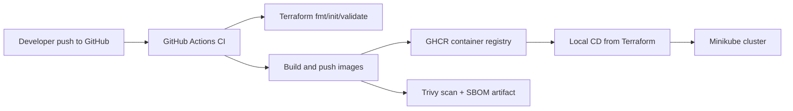
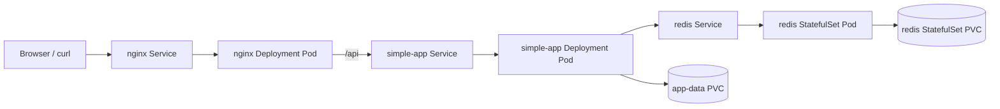

# Week 11: Infrastructure as Code and CI/CD

This week turns the Kubernetes stack from Week 10 into a reproducible, version-controlled deployment workflow.

The same application stack is still used:

- `nginx`: public entry point and reverse proxy
- `simple-app`: Python backend service
- `redis`: persistent data store for the backend visit counter

The difference is that the stack is no longer managed by manually applying Kubernetes YAML files one by one. Instead, Terraform becomes the entry point for deployment, environment separation is handled through workspaces and tfvars, and GitHub Actions provides CI for image building, image publishing, and IaC validation.

This implementation covers:

- `Core / Basic`: Terraform-based IaC, local deployment to Minikube, CI validation, and image publishing
- `Intermediate`: multiple environments (`dev` and `staging`)
- `Advanced`: security scanning, SBOM generation, build cache, stable tags, and rollback validation

## 1. Project Structure

```text
week-11-iac/
|-- docker/
|   `-- simple-app.Dockerfile
|-- terraform/
|   |-- apply.tf
|   |-- locals.tf
|   |-- manifests.tf
|   |-- outputs.tf
|   |-- variables.tf
|   |-- versions.tf
|   `-- environments/
|       |-- dev.tfvars
|       `-- staging.tfvars
|-- verify_week11.py
`-- README.md

.github/
`-- workflows/
    `-- ci.yml
```

Each part has a clear responsibility:

- `docker/simple-app.Dockerfile`: builds the backend image used by Terraform and CI
- `terraform/`: defines the full Kubernetes stack as code
- `terraform/environments/`: separates environment-specific values
- `verify_week11.py`: automates the end-to-end verification flow
- `.github/workflows/ci.yml`: validates Terraform and publishes deployable container images

## 2. Architecture

Two layers matter in this week:

- the in-cluster application architecture
- the delivery pipeline that produces and deploys the infrastructure

### 2.1 Delivery Architecture



Important constraint:

GitHub-hosted runners cannot access a local Minikube cluster on a student's laptop. Because of that, the workflow is intentionally split into:

- `CI on GitHub Actions`: validate Terraform, build images, tag them, push them, scan them
- `Local CD`: run Terraform locally against Minikube

### 2.2 Application Architecture



Traffic flow:

1. A client reaches the `nginx` Service.
2. Nginx serves static content at `/`.
3. Requests to `/api/` are proxied to the `simple-app` Service.
4. The backend reads configuration from environment variables injected by a ConfigMap.
5. The backend stores visit counters in Redis.
6. Both the backend and Redis use persistent storage.

## 3. Why Terraform

Terraform was chosen instead of Ansible for three reasons:

1. It matches the assignment recommendation.
2. It keeps infrastructure declarative and parameterized through variables.
3. It makes environment reproduction easier through workspaces, tfvars, and outputs.

In this repository, Terraform is the single deployment entry point for Week 11.

The code defines:

- namespaces
- persistent storage
- ConfigMaps
- Services
- Deployments
- a StatefulSet

It also exposes reusable variables for images, ports, environment names, storage paths, and replica counts.

## 4. Terraform Design

### 4.1 Implementation Approach

The Terraform code does not store raw Kubernetes manifests as disconnected files. Instead, it generates the manifests from Terraform locals and applies them from Terraform.

The key files are:

- [locals.tf](terraform/locals.tf)
- [manifests.tf](terraform/manifests.tf)
- [apply.tf](terraform/apply.tf)

This gives us a few advantages:

- Terraform remains the source of truth
- the Kubernetes objects are still readable as YAML-shaped structures
- environment-specific changes stay in variables instead of duplicated manifests
- the deployment remains local to Minikube, which fits the assignment constraint

### 4.2 Resource Grouping

The Terraform stack is intentionally split into several `terraform_data` resource groups:

- `namespace`
- `app_pv`
- `app_pvc`
- `redis_stack`
- `simple_app_stack`
- `nginx_stack`

This split is important.

During development, a first version grouped too many resources together, which caused unnecessary replacement of the PVC when only the backend configuration changed. That could break storage reuse in rollback scenarios. The current structure avoids that problem by isolating storage resources from frequently changing application configuration.

### 4.3 Variables

The main configurable inputs are defined in [variables.tf](terraform/variables.tf).

The most relevant ones are:

- `environment_name`
- `app_message`
- `nginx_node_port`
- `nginx_image`
- `simple_app_image`
- `redis_image`
- `nginx_replicas`
- `simple_app_replicas`
- `redis_replicas`
- `app_pv_host_path`
- `app_storage_size`
- `redis_storage_size`

This keeps the deployment flexible without editing the Terraform logic itself.

### 4.4 Outputs

Useful outputs are defined in [outputs.tf](terraform/outputs.tf):

- `namespace`
- `nginx_node_port`
- `app_persistent_volume_name`
- `simple_app_image`
- `nginx_image`

These outputs are helpful after `terraform apply` because they summarize which environment and image references were actually used.

## 5. Environment Separation

This week includes two environments from one codebase:

- `dev`
- `staging`

The environment-specific values live in:

- [dev.tfvars](terraform/environments/dev.tfvars)
- [staging.tfvars](terraform/environments/staging.tfvars)

Current values:

### `dev`

- namespace: `green-dev-dev`
- backend message: `Hello from Terraform dev`
- nginx `NodePort`: `31080`
- backend host path PV: `/data/gsx-app-dev`

### `staging`

- namespace: `green-dev-staging`
- backend message: `Hello from Terraform staging`
- nginx `NodePort`: `31081`
- backend host path PV: `/data/gsx-app-staging`

Terraform workspaces are used so both environments can exist at the same time with separate local state:

- workspace `dev`
- workspace `staging`

This directly addresses the `Intermediate` requirement for multiple environments.

## 6. CI/CD Pipeline

The CI pipeline is defined in [ci.yml](../../.github/workflows/ci.yml).

### 6.1 Triggers

The workflow runs on:

- pushes to `main`
- manual `workflow_dispatch`

The manual trigger includes a `promote_stable` option so a stable image tag can be published intentionally.

### 6.2 Job 1: Terraform Validation

The first job runs:

```bash
terraform fmt -check -recursive
terraform init -backend=false
terraform validate
```

This ensures the IaC is syntactically valid and formatted before any image build is considered deployable.

### 6.3 Job 2: Build and Publish Images

The second job builds two images:

- `green-devcorp-nginx`
- `green-devcorp-simple-app`

The workflow:

- checks out the repository
- sets up Buildx
- logs into GHCR
- builds and pushes both images
- applies caching with GitHub Actions cache

### 6.4 Tag Strategy

The workflow publishes:

- `sha-<commit>` tags for immutable CI artifacts
- `stable` tags when manually promoted

This satisfies the advanced release/tag strategy requirement and makes rollback practical.

### 6.5 Security and Supply Chain Features

The CI workflow also includes:

- `Trivy` vulnerability scanning
- SARIF upload to GitHub code scanning
- `SBOM` generation with `anchore/sbom-action`
- upload of deployable image metadata as workflow artifacts

This covers the advanced CI/CD requirements around security scanning and artifact generation.

### 6.6 Manual Verification in GitHub Actions

The repository README is not part of the workflow `push` path filter. Because of that, a commit that only changes `weeks/week-11-iac/README.md` does not trigger the workflow automatically.

The `push` trigger currently reacts to changes in:

- `.github/workflows/ci.yml`
- `weeks/week-08-docker/nginx/**`
- `weeks/week-09-compose/docker-compose/simple-app/app.py`
- `weeks/week-09-compose/docker-compose/simple-app/requirements.txt`
- `weeks/week-11-iac/docker/simple-app.Dockerfile`
- `weeks/week-11-iac/terraform/**`

If you want to check the CI manually from the GitHub web UI, use this sequence:

1. Open the repository `Actions` tab and select the `week11-ci` workflow.
2. Open the latest green run triggered by `push` or start a manual run with `workflow_dispatch`.
3. Verify that `validate-terraform` is green.
4. Verify that both matrix jobs in `build-images` are green:
   - `nginx`
   - `simple-app`
5. Open each image job and confirm these steps are green:
   - `Build and push image`
   - `Scan image with Trivy`
   - `Upload Trivy results`
   - `Generate SBOM`
   - `Upload image metadata and SBOM`
6. Open the `Artifacts` section of the run and verify that deployable metadata and SBOM artifacts were uploaded.
7. If the run was started manually with `promote_stable=true`, verify that the workflow also published the `stable` image tag.

Expected result:

- the entire workflow is green
- Terraform validation passes
- both images are built and pushed
- Trivy scanning passes
- SARIF upload succeeds
- SBOM files are generated
- workflow artifacts are available for download
- `stable` tags are only published during intentional manual promotion

## 7. Local CD Workflow

Because GitHub Actions cannot deploy into local Minikube, deployment is intentionally local.

### 7.1 Lab workflow with local images

This is the workflow used for local validation in this repository:

1. Build or rebuild the images locally.
2. Load or build those images inside Minikube.
3. Run Terraform locally against the Minikube context.

### 7.2 Deployment using CI-produced image tags

The Terraform code supports image overrides through variables, so the cluster can be updated with the exact SHA tags produced by CI.

Example:

```bash
terraform workspace select dev
terraform apply \
  -var-file ./environments/dev.tfvars \
  -var "nginx_image=ghcr.io/<owner>/green-devcorp-nginx:sha-<commit>" \
  -var "simple_app_image=ghcr.io/<owner>/green-devcorp-simple-app:sha-<commit>" \
  -auto-approve
```

The workflow uploads `image-nginx.env` and `image-simple-app.env` artifacts that contain the deployable `IMAGE_NAME=...` references. Those references are the intended handoff between CI and local CD.

## 8. How to Run Locally

### 8.1 Prerequisites

Make sure the following tools are available:

- `docker`
- `minikube`
- `kubectl`
- `terraform`
- `py -3`

Start Minikube first:

```bash
minikube start
```

### 8.2 Build the Images

Build the Nginx image:

```bash
docker build -t nginx-gsx:latest weeks/week-08-docker/nginx
```

Build the backend image:

```bash
docker build -t simple-app-gsx:latest -f weeks/week-11-iac/docker/simple-app.Dockerfile .
```

### 8.3 Load Images into Minikube

For the local lab workflow, the same images are also built in the Minikube runtime:

```bash
minikube image build -t nginx-gsx:latest weeks/week-08-docker/nginx
minikube image build -t simple-app-gsx:latest -f weeks/week-11-iac/docker/simple-app.Dockerfile .
```

### 8.4 Initialize Terraform

From `weeks/week-11-iac/terraform/`:

```bash
terraform init -backend=false
```

### 8.5 Deploy `dev`

```bash
terraform workspace new dev
terraform apply -var-file ./environments/dev.tfvars -auto-approve
```

If the workspace already exists:

```bash
terraform workspace select dev
terraform apply -var-file ./environments/dev.tfvars -auto-approve
```

### 8.6 Deploy `staging`

```bash
terraform workspace new staging
terraform apply -var-file ./environments/staging.tfvars -auto-approve
```

Or:

```bash
terraform workspace select staging
terraform apply -var-file ./environments/staging.tfvars -auto-approve
```

### 8.7 Inspect Outputs

```bash
terraform output
```

### 8.8 Destroy an Environment

```bash
terraform destroy -var-file ./environments/dev.tfvars -auto-approve
```

Or:

```bash
terraform destroy -var-file ./environments/staging.tfvars -auto-approve
```

## 9. How to Verify

### 9.1 Manual Verification

Important manual checks include:

- `kubectl get pods -n green-dev-dev`
- `kubectl get services -n green-dev-dev`
- `kubectl get pvc,pv -n green-dev-dev`
- `terraform plan -var-file ./environments/dev.tfvars -detailed-exitcode`
- `kubectl exec -n green-dev-dev deploy/nginx -- curl -fsS http://simple-app:5000/`
- `kubectl exec -n green-dev-dev redis-0 -- redis-cli ping`

The same pattern can be repeated for `green-dev-staging`.

### 9.2 Automated Verification Script

The repository includes:

- [verify_week11.py](verify_week11.py)

Before running it, make sure the local dependencies it needs are actually alive:

- Docker CLI is installed: `docker --version`
- Docker daemon is reachable: `docker version --format "{{.Server.Version}}"`
- Minikube is installed: `minikube version`
- Minikube control plane is running: `minikube status`
- the active Kubernetes context is `minikube`: `kubectl config current-context`
- the Kubernetes API is reachable: `kubectl cluster-info`

This matters because the script builds images with Docker, builds them again inside Minikube, applies Terraform locally, and then verifies the resulting Kubernetes workloads through `kubectl`.

The script resolves repository paths relative to its own file, so it can be launched from the repository root, from `weeks/week-11-iac/`, or from another working directory as long as you pass the script path.

Example from the repository root:

```bash
py -3 weeks/week-11-iac/verify_week11.py
```

Example from inside `weeks/week-11-iac/`:

```bash
py -3 verify_week11.py
```

The script is not a black box. It prints every command it executes and reports explicit `[PASS]` or `[FAIL]` lines.

### 9.3 What the Script Validates

A successful run currently contains these test blocks:

1. `Prerequisites`

   - checks that `terraform`, `kubectl`, `minikube`, and `docker` are
     available
   - checks that the Docker daemon is reachable
   - checks that Minikube reports a running control plane
   - confirms that the active Kubernetes context is `minikube`
   - confirms that `kubectl` can reach the Kubernetes API server
   - stops early if these prerequisite checks fail, to avoid misleading
     follow-up errors in later test blocks

2. `Build images`

   - builds the `nginx` image locally
   - builds the `simple-app` image locally
   - builds both images inside Minikube

3. `Terraform validation`

   - runs `terraform fmt -check -recursive`
   - runs `terraform init -backend=false`
   - runs `terraform validate`

4. `Deploy dev from scratch`

   - selects the `dev` workspace
   - destroys any previous `dev` deployment
   - reapplies the full stack from Terraform

5. `Verify dev environment`

   - checks Terraform outputs
   - verifies the existence of namespace, PV, PVC, ConfigMaps, Services,
     Deployments, and StatefulSet
   - waits for `nginx`, `simple-app`, and `redis` to become ready
   - checks that service types and NodePort values match the Terraform
     config
   - verifies backend environment variables and Nginx reverse-proxy config
   - checks readiness probes, liveness probes, resource requests, and
     resource limits
   - verifies Redis ping
   - verifies in-cluster connectivity
   - verifies external HTTP access through Nginx using
     `kubectl port-forward`
   - tests scaling
   - tests self-healing
   - tests backend persistence
   - tests Redis persistence
   - checks `terraform plan -detailed-exitcode` for idempotence
   - applies a temporary configuration change and verifies rollback

6. `Deploy staging from scratch`

   - repeats the same Terraform recreation flow in the `staging`
     workspace

7. `Verify staging environment`

   - confirms `staging` works independently from `dev`
   - verifies the `staging` message, namespace, Service exposure, and
     idempotence

8. `Multiple environments`

   - proves that `dev` and `staging` coexist from the same codebase

9. `CI workflow static checks`

   - verifies that the GitHub Actions workflow includes Terraform
     validation
   - verifies image build and push logic
   - verifies SHA and stable tag logic
   - verifies cache, Trivy, SARIF upload, and SBOM steps

### 9.4 Why the Script Uses Port-Forward

On Windows with Minikube's Docker driver, direct access to a `NodePort` through the Minikube IP can be less reliable than `kubectl port-forward`.

Because of that, the script:

- verifies the `NodePort` configuration structurally through Kubernetes
- verifies the real HTTP path through `kubectl port-forward`

This makes the test more stable while still proving that the service is correctly exposed by Terraform.

### 9.5 Successful Result

A passing run ends with:

```text
FINAL SUMMARY
Passed: 9
Failed: 0
```

## 10. Rollback Strategy

Rollback is documented and validated in two ways.

### 10.1 Configuration Rollback

The verification script proves configuration rollback in `test_rollback()`.

The script does not change the backend image. Instead, it temporarily overrides only:

- `app_message`

The automated sequence is:

1. Run `terraform apply` for `dev` with an extra variable override:

   ```bash
   terraform apply -var-file ./environments/dev.tfvars -var "app_message=Hello from Terraform rollback candidate" -auto-approve
   ```

2. Wait until the `simple-app` Deployment is ready again.
3. Verify that the backend response now contains `Hello from Terraform rollback candidate`.

   To see the same result in a browser, run this in a separate terminal and keep it open:

   ```bash
   kubectl -n green-dev-dev port-forward service/nginx 8080:80
   ```

   Then open and refresh:

   ```text
   http://127.0.0.1:8080/api/
   ```

4. Reapply the baseline Terraform configuration without the override:

   ```bash
   terraform apply -var-file ./environments/dev.tfvars -auto-approve
   ```

5. Wait again for the Deployment to become ready.
6. Verify that the backend response is back to `Hello from Terraform dev`.

   The same browser view should now return to the baseline message when you refresh:

   ```text
   http://127.0.0.1:8080/api/
   ```

This proves that Terraform can safely revert configuration changes while keeping the same application image and the same persistent storage resources.

#### Manual Demonstration of Configuration Rollback

Run these commands from `weeks/week-11-iac/terraform/`.

1. Select the `dev` workspace.

   ```bash
   terraform workspace select dev
   ```

2. Record the baseline configuration, deployed image, and backend response.

   ```bash
   kubectl -n green-dev-dev get configmap simple-app-config -o jsonpath='{.data.APP_MESSAGE}'
   kubectl -n green-dev-dev get deployment simple-app -o jsonpath='{.spec.template.spec.containers[0].image}'
   kubectl -n green-dev-dev exec deploy/nginx -- curl -s http://simple-app:5000/
   ```

   To see the same backend response in a browser, run this in a separate terminal and keep it open during the whole rollback demonstration:

   ```bash
   kubectl -n green-dev-dev port-forward service/nginx 8080:80
   ```

   Then open:

   ```text
   http://127.0.0.1:8080/api/
   ```

   Expected results:

   - the ConfigMap returns:

     ```text
     Hello from Terraform dev
     ```

   - the image stays on the currently deployed backend tag, for example:

     ```text
     simple-app-gsx:latest
     ```

   - the backend response looks like:

     ```text
     Hello from Terraform dev | Visits: <n>
     ```

3. Apply a temporary configuration change.

   ```bash
   terraform apply -var-file ./environments/dev.tfvars -var "app_message=Hello from Terraform rollback candidate" -auto-approve
   kubectl -n green-dev-dev rollout status deployment/simple-app --timeout=180s
   ```

   Expected result:

   - `deployment "simple-app" successfully rolled out`

4. Verify that the configuration changed but the image did not.

   ```bash
   kubectl -n green-dev-dev get configmap simple-app-config -o jsonpath='{.data.APP_MESSAGE}'
   kubectl -n green-dev-dev get deployment simple-app -o jsonpath='{.spec.template.spec.containers[0].image}'
   kubectl -n green-dev-dev exec deploy/nginx -- curl -s http://simple-app:5000/
   ```

   In the browser, refresh:

   ```text
   http://127.0.0.1:8080/api/
   ```

   Expected results:

   - the ConfigMap now returns:

     ```text
     Hello from Terraform rollback candidate
     ```

   - the image is still the same backend image as before
   - the backend response now looks like:

     ```text
     Hello from Terraform rollback candidate | Visits: <n>
     ```

5. Roll back to the baseline Terraform configuration.

   ```bash
   terraform apply -var-file ./environments/dev.tfvars -auto-approve
   kubectl -n green-dev-dev rollout status deployment/simple-app --timeout=180s
   ```

   Expected result:

   - `deployment "simple-app" successfully rolled out`

6. Verify that the original message is restored.

   ```bash
   kubectl -n green-dev-dev get configmap simple-app-config -o jsonpath='{.data.APP_MESSAGE}'
   kubectl -n green-dev-dev get deployment simple-app -o jsonpath='{.spec.template.spec.containers[0].image}'
   kubectl -n green-dev-dev exec deploy/nginx -- curl -s http://simple-app:5000/
   ```

   In the browser, refresh:

   ```text
   http://127.0.0.1:8080/api/
   ```

   Expected results:

   - the ConfigMap returns again:

     ```text
     Hello from Terraform dev
     ```

   - the image is still the same backend image
   - the backend response returns to:

     ```text
     Hello from Terraform dev | Visits: <n>
     ```

This is the clearest manual proof of configuration rollback:

- the message changes
- the image does not change
- the original message can be restored with a second `terraform apply`

### 10.2 Image Rollback

Because CI publishes immutable `sha-<commit>` tags, a previous image can be restored by reapplying Terraform with an older tag:

```bash
terraform apply \
  -var-file ./environments/dev.tfvars \
  -var "nginx_image=ghcr.io/<owner>/green-devcorp-nginx:sha-<previous-commit>" \
  -var "simple_app_image=ghcr.io/<owner>/green-devcorp-simple-app:sha-<previous-commit>" \
  -auto-approve
```

That is the intended rollback procedure for deployed application versions when CI has already published the images to a registry.

For the local manual validation in this repository, the same rollback idea can be demonstrated without GitHub Actions and without using the verification script.

The important idea is that image rollback cannot be proved by applying the same image tag twice. A second backend image with visibly different behavior must exist first, so the rollback can be observed from the running service.

If you want to save setup time before a live demonstration, [prepare_image_rollback.py](prepare_image_rollback.py) automates steps 1 to 8, checks that Minikube is operational, recreates the temporary build context, and leaves the environment ready for the manual walkthrough from step 9 onward. It resolves paths relative to itself, so it can be launched from any working directory with `py -3 weeks/week-11-iac/prepare_image_rollback.py`. The manual steps below remain the canonical demonstration sequence.

#### Manual Demonstration of Image Rollback

Run steps 1 to 8 from the repository root.

Run steps 9 to 15 from `weeks/week-11-iac/terraform/`.

1. Create a temporary build folder, for example `weeks/week-11-iac/manual-image-rollback/`.

2. Inside that folder, create `requirements.txt` with:

   ```text
   redis==7.4.0
   ```

3. Inside that folder, create `Dockerfile` with:

   ```dockerfile
   FROM python:3.12-alpine

   ENV PYTHONDONTWRITEBYTECODE=1 \
       PYTHONUNBUFFERED=1 \
       PORT=5000

   WORKDIR /app

   RUN addgroup -S app && adduser -S app -G app

   COPY requirements.txt ./requirements.txt
   RUN pip install --no-cache-dir -r requirements.txt

   COPY app.py ./app.py
   RUN chown -R app:app /app

   USER app

   EXPOSE 5000

   HEALTHCHECK --interval=30s --timeout=3s \
     CMD python -c "import urllib.request; urllib.request.urlopen('http://localhost:5000/health')" || exit 1

   CMD ["python", "app.py"]
   ```

4. Copy the original backend source from `weeks/week-09-compose/docker-compose/simple-app/app.py` into `weeks/week-11-iac/manual-image-rollback/app.py`.

5. In that temporary `app.py`, change only the root response line:

   From:

   ```python
   self._send_text(200, f"{MESSAGE} | Visits: {visits}")
   ```

   To:

   ```python
   self._send_text(200, f"{MESSAGE} | Visits: {visits} | Image: rollback-new")
   ```

6. Build the baseline image and the modified image locally.

   ```bash
   docker build -t simple-app-gsx:rollback-old -f ./weeks/week-11-iac/docker/simple-app.Dockerfile .
   docker build -t simple-app-gsx:rollback-new ./weeks/week-11-iac/manual-image-rollback
   docker images simple-app-gsx
   ```

   Expected results:

   - both builds finish without error
   - `docker images simple-app-gsx` lists at least:

     ```text
     simple-app-gsx   rollback-old
     simple-app-gsx   rollback-new
     ```

7. Optionally inspect the image contents before deploying them.

   ```bash
   docker run --rm simple-app-gsx:rollback-old cat /app/app.py
   docker run --rm simple-app-gsx:rollback-new cat /app/app.py
   ```

   Expected results:

   - the `rollback-old` output does not contain `| Image: rollback-new`
   - the `rollback-new` output contains:

     ```text
     | Image: rollback-new
     ```

8. Build both images inside Minikube so the cluster can use them.

   ```bash
   minikube image build -t simple-app-gsx:rollback-old -f ./weeks/week-11-iac/docker/simple-app.Dockerfile .
   minikube image build -t simple-app-gsx:rollback-new ./weeks/week-11-iac/manual-image-rollback
   ```

   Expected result:

   - both commands finish without error

9. Change into the Terraform directory.

   ```bash
   cd weeks/week-11-iac/terraform
   ```

10. Select the `dev` workspace and record the current baseline.

   ```bash
   terraform workspace select dev
   kubectl -n green-dev-dev get deployment simple-app -o jsonpath='{.spec.template.spec.containers[0].image}'
   kubectl -n green-dev-dev exec deploy/nginx -- curl -s http://simple-app:5000/
   ```

   To see the same backend response in a browser, run this in a separate terminal and keep it open during the whole image rollback demonstration:

   ```bash
   kubectl -n green-dev-dev port-forward service/nginx 8080:80
   ```

   Then open:

   ```text
   http://127.0.0.1:8080/api/
   ```

   Expected results:

   - the current image is the baseline backend image, usually:

     ```text
     simple-app-gsx:latest
     ```

   - the backend response looks like:

     ```text
     Hello from Terraform dev | Visits: <n>
     ```

11. Deploy the baseline rollback image.

    ```bash
    terraform apply -var-file ./environments/dev.tfvars -var "simple_app_image=simple-app-gsx:rollback-old" -auto-approve
    kubectl -n green-dev-dev rollout status deployment/simple-app --timeout=180s
    kubectl -n green-dev-dev get deployment simple-app -o jsonpath='{.spec.template.spec.containers[0].image}'
    kubectl -n green-dev-dev exec deploy/nginx -- curl -s http://simple-app:5000/
    ```

    In the browser, refresh:

    ```text
    http://127.0.0.1:8080/api/
    ```

    Expected results:

    - rollout ends with:

      ```text
      deployment "simple-app" successfully rolled out
      ```

    - the Deployment image is now:

      ```text
      simple-app-gsx:rollback-old
      ```

    - the backend response still looks normal:

      ```text
      Hello from Terraform dev | Visits: <n>
      ```

12. Deploy the modified rollback image.

    ```bash
    terraform apply -var-file ./environments/dev.tfvars -var "simple_app_image=simple-app-gsx:rollback-new" -auto-approve
    kubectl -n green-dev-dev rollout status deployment/simple-app --timeout=180s
    kubectl -n green-dev-dev get deployment simple-app -o jsonpath='{.spec.template.spec.containers[0].image}'
    kubectl -n green-dev-dev get pods -l app=simple-app -o wide
    kubectl -n green-dev-dev exec deploy/nginx -- curl -s http://simple-app:5000/
    ```

    In the browser, refresh:

    ```text
    http://127.0.0.1:8080/api/
    ```

    Expected results:

    - rollout ends successfully
    - the Deployment image becomes:

      ```text
      simple-app-gsx:rollback-new
      ```

    - the backend response now includes the visible marker:

      ```text
      Hello from Terraform dev | Visits: <n> | Image: rollback-new
      ```

13. Roll back to the previous backend image.

    ```bash
    terraform apply -var-file ./environments/dev.tfvars -var "simple_app_image=simple-app-gsx:rollback-old" -auto-approve
    kubectl -n green-dev-dev rollout status deployment/simple-app --timeout=180s
    kubectl -n green-dev-dev get deployment simple-app -o jsonpath='{.spec.template.spec.containers[0].image}'
    kubectl -n green-dev-dev get pods -l app=simple-app -o wide
    kubectl -n green-dev-dev exec deploy/nginx -- curl -s http://simple-app:5000/
    ```

    In the browser, refresh:

    ```text
    http://127.0.0.1:8080/api/
    ```

    Expected results:

    - rollout ends successfully
    - the Deployment image changes back to:

      ```text
      simple-app-gsx:rollback-old
      ```

    - the backend response returns to:

      ```text
      Hello from Terraform dev | Visits: <n>
      ```

    - the marker `| Image: rollback-new` is gone

14. Restore the repository default image tag.

    ```bash
    terraform apply -var-file ./environments/dev.tfvars -auto-approve
    kubectl -n green-dev-dev rollout status deployment/simple-app --timeout=180s
    kubectl -n green-dev-dev get deployment simple-app -o jsonpath='{.spec.template.spec.containers[0].image}'
    kubectl -n green-dev-dev exec deploy/nginx -- curl -s http://simple-app:5000/
    ```

    In the browser, refresh:

    ```text
    http://127.0.0.1:8080/api/
    ```

    Expected results:

    - the Deployment image returns to:

      ```text
      simple-app-gsx:latest
      ```

    - the backend response still looks normal:

      ```text
      Hello from Terraform dev | Visits: <n>
      ```

15. Remove the temporary `manual-image-rollback/` folder after the demonstration.

This is the clearest manual proof of image rollback:

- the deployed image tag changes
- the backend response changes with it
- Terraform can return the Deployment to the previous image
- the default image tag can be restored at the end

During a rollout there can be a short overlap where one pod is terminating and another is starting. In that moment, use `kubectl get pods -l app=simple-app -o wide` and wait until only the current running pod remains before concluding the verification.

## 11. Mapping to Week 11 Deliverables

### Core / Basic

- [x] Terraform chosen as the IaC tool
- [x] Full stack defined as code in `terraform/`
- [x] Variables used for configuration instead of hardcoded values
- [x] `terraform init`, `plan`, `apply`, and `destroy` supported
- [x] CI workflow created in `.github/workflows/ci.yml`
- [x] CI validates Terraform without applying to Minikube
- [x] CI builds and publishes deployable images
- [x] Local CD workflow documented and tested

### Intermediate

- [x] Multiple environments implemented with one codebase
- [x] Separate `dev` and `staging` tfvars files provided
- [x] Separate workspaces used for local state separation
- [x] Independent namespaces and NodePorts verified

### Advanced

- [x] Vulnerability scanning included in CI
- [x] SBOM generation included in CI
- [x] Build cache included in CI
- [x] SHA-based image tags included in CI
- [x] Manual stable promotion path included in CI
- [x] Rollback procedure implemented and verified

## 12. Final Notes

This week completes the transition from:

- manual Kubernetes commands

to:

- infrastructure defined as code
- image production through CI
- reproducible multi-environment deployment
- scripted verification of the whole workflow

The result is a stack that is easier to explain, easier to reproduce, safer to update, and much closer to a real DevOps workflow than the manual approach from earlier weeks.
