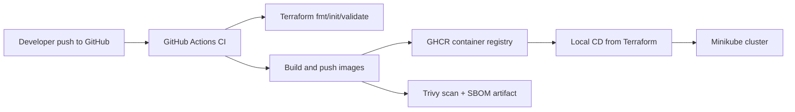
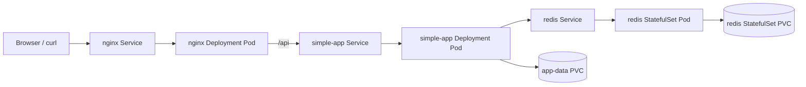

# Week 11: Infrastructure as Code and CI/CD

This week turns the Kubernetes stack from Week 10 into a reproducible, version-controlled deployment workflow.

The same application stack is still used:

- `nginx`: public entry point and reverse proxy
- `simple-app`: Python backend service
- `redis`: persistent data store for the backend visit counter

The difference is that the stack is no longer managed by manually applying Kubernetes YAML files one by one. Instead, Terraform becomes the entry point for deployment, environment separation is handled through workspaces and tfvars, and GitHub Actions provides CI for image building, image publishing, and IaC validation.

This implementation covers:

- `Core / Basic`: Terraform-based IaC, local deployment to Minikube, CI validation, and image publishing
- `Intermediate`: multiple environments (`dev` and `staging`)
- `Advanced`: security scanning, SBOM generation, build cache, stable tags, and rollback validation

## 1. Project Structure

```text
week-11-iac/
|-- docker/
|   `-- simple-app.Dockerfile
|-- terraform/
|   |-- apply.tf
|   |-- locals.tf
|   |-- manifests.tf
|   |-- outputs.tf
|   |-- variables.tf
|   |-- versions.tf
|   `-- environments/
|       |-- dev.tfvars
|       `-- staging.tfvars
|-- verify_week11.py
`-- README.md

.github/
`-- workflows/
    `-- ci.yml
```

Each part has a clear responsibility:

- `docker/simple-app.Dockerfile`: builds the backend image used by Terraform and CI
- `terraform/`: defines the full Kubernetes stack as code
- `terraform/environments/`: separates environment-specific values
- `verify_week11.py`: automates the end-to-end verification flow
- `.github/workflows/ci.yml`: validates Terraform and publishes deployable container images

## 2. Architecture

Two layers matter in this week:

- the in-cluster application architecture
- the delivery pipeline that produces and deploys the infrastructure

### 2.1 Delivery Architecture



Important constraint:

GitHub-hosted runners cannot access a local Minikube cluster on a student's laptop. Because of that, the workflow is intentionally split into:

- `CI on GitHub Actions`: validate Terraform, build images, tag them, push them, scan them
- `Local CD`: run Terraform locally against Minikube

### 2.2 Application Architecture



Traffic flow:

1. A client reaches the `nginx` Service.
2. Nginx serves static content at `/`.
3. Requests to `/api/` are proxied to the `simple-app` Service.
4. The backend reads configuration from environment variables injected by a ConfigMap.
5. The backend stores visit counters in Redis.
6. Both the backend and Redis use persistent storage.

## 3. Why Terraform

Terraform was chosen instead of Ansible for three reasons:

1. It matches the assignment recommendation.
2. It keeps infrastructure declarative and parameterized through variables.
3. It makes environment reproduction easier through workspaces, tfvars, and outputs.

In this repository, Terraform is the single deployment entry point for Week 11.

The code defines:

- namespaces
- persistent storage
- ConfigMaps
- Services
- Deployments
- a StatefulSet

It also exposes reusable variables for images, ports, environment names, storage paths, and replica counts.

## 4. Terraform Design

### 4.1 Implementation Approach

The Terraform code does not store raw Kubernetes manifests as disconnected files. Instead, it generates the manifests from Terraform locals and applies them from Terraform.

The key files are:

- [locals.tf](terraform/locals.tf)
- [manifests.tf](terraform/manifests.tf)
- [apply.tf](terraform/apply.tf)

This gives us a few advantages:

- Terraform remains the source of truth
- the Kubernetes objects are still readable as YAML-shaped structures
- environment-specific changes stay in variables instead of duplicated manifests
- the deployment remains local to Minikube, which fits the assignment constraint

### 4.2 Resource Grouping

The Terraform stack is intentionally split into several `terraform_data` resource groups:

- `namespace`
- `app_pv`
- `app_pvc`
- `redis_stack`
- `simple_app_stack`
- `nginx_stack`

This split is important.

During development, a first version grouped too many resources together, which caused unnecessary replacement of the PVC when only the backend configuration changed. That could break storage reuse in rollback scenarios. The current structure avoids that problem by isolating storage resources from frequently changing application configuration.

### 4.3 Variables

The main configurable inputs are defined in [variables.tf](terraform/variables.tf).

The most relevant ones are:

- `environment_name`
- `app_message`
- `nginx_node_port`
- `nginx_image`
- `simple_app_image`
- `redis_image`
- `nginx_replicas`
- `simple_app_replicas`
- `redis_replicas`
- `app_pv_host_path`
- `app_storage_size`
- `redis_storage_size`

This keeps the deployment flexible without editing the Terraform logic itself.

### 4.4 Outputs

Useful outputs are defined in [outputs.tf](terraform/outputs.tf):

- `namespace`
- `nginx_node_port`
- `app_persistent_volume_name`
- `simple_app_image`
- `nginx_image`

These outputs are helpful after `terraform apply` because they summarize which environment and image references were actually used.

## 5. Environment Separation

This week includes two environments from one codebase:

- `dev`
- `staging`

The environment-specific values live in:

- [dev.tfvars](terraform/environments/dev.tfvars)
- [staging.tfvars](terraform/environments/staging.tfvars)

Current values:

### `dev`

- namespace: `green-dev-dev`
- backend message: `Hello from Terraform dev`
- nginx `NodePort`: `31080`
- backend host path PV: `/data/gsx-app-dev`

### `staging`

- namespace: `green-dev-staging`
- backend message: `Hello from Terraform staging`
- nginx `NodePort`: `31081`
- backend host path PV: `/data/gsx-app-staging`

Terraform workspaces are used so both environments can exist at the same time with separate local state:

- workspace `dev`
- workspace `staging`

This directly addresses the `Intermediate` requirement for multiple environments.

## 6. CI/CD Pipeline

The CI pipeline is defined in [ci.yml](../../.github/workflows/ci.yml).

### 6.1 Triggers

The workflow runs on:

- pushes to `main`
- manual `workflow_dispatch`

The manual trigger includes a `promote_stable` option so a stable image tag can be published intentionally.

### 6.2 Job 1: Terraform Validation

The first job runs:

```bash
terraform fmt -check -recursive
terraform init -backend=false
terraform validate
```

This ensures the IaC is syntactically valid and formatted before any image build is considered deployable.

### 6.3 Job 2: Build and Publish Images

The second job builds two images:

- `green-devcorp-nginx`
- `green-devcorp-simple-app`

The workflow:

- checks out the repository
- sets up QEMU and Buildx
- logs into GHCR
- builds and pushes both images
- applies caching with GitHub Actions cache

### 6.4 Tag Strategy

The workflow publishes:

- `sha-<commit>` tags for immutable CI artifacts
- `main` tags for the latest `main` branch build
- `stable` tags when manually promoted

This satisfies the advanced release/tag strategy requirement and makes rollback practical.

### 6.5 Security and Supply Chain Features

The CI workflow also includes:

- `Trivy` vulnerability scanning
- SARIF upload to GitHub code scanning
- `SBOM` generation with `anchore/sbom-action`
- upload of deployable image metadata as workflow artifacts

This covers the advanced CI/CD requirements around security scanning and artifact generation.

## 7. Local CD Workflow

Because GitHub Actions cannot deploy into local Minikube, deployment is intentionally local.

### 7.1 Lab workflow with local images

This is the workflow used for local validation in this repository:

1. Build or rebuild the images locally.
2. Load or build those images inside Minikube.
3. Run Terraform locally against the Minikube context.

### 7.2 Deployment using CI-produced image tags

The Terraform code supports image overrides through variables, so the cluster can be updated with the exact SHA tags produced by CI.

Example:

```bash
terraform workspace select dev
terraform apply \
  -var-file=environments/dev.tfvars \
  -var="nginx_image=ghcr.io/<owner>/green-devcorp-nginx:sha-<commit>" \
  -var="simple_app_image=ghcr.io/<owner>/green-devcorp-simple-app:sha-<commit>" \
  -auto-approve
```

The workflow uploads `image-nginx.env` and `image-simple-app.env` artifacts that contain the deployable `IMAGE_NAME=...` references. Those references are the intended handoff between CI and local CD.

## 8. How to Run Locally

### 8.1 Prerequisites

Make sure the following tools are available:

- `docker`
- `minikube`
- `kubectl`
- `terraform`
- `py -3`

Start Minikube first:

```bash
minikube start
```

### 8.2 Build the Images

Build the Nginx image:

```bash
docker build -t nginx-gsx:latest weeks/week-08-docker/nginx
```

Build the backend image:

```bash
docker build -t simple-app-gsx:latest -f weeks/week-11-iac/docker/simple-app.Dockerfile .
```

### 8.3 Load Images into Minikube

For the local lab workflow, the same images are also built in the Minikube runtime:

```bash
minikube image build -t nginx-gsx:latest weeks/week-08-docker/nginx
minikube image build -t simple-app-gsx:latest -f weeks/week-11-iac/docker/simple-app.Dockerfile .
```

### 8.4 Initialize Terraform

From `weeks/week-11-iac/terraform/`:

```bash
terraform init -backend=false
```

### 8.5 Deploy `dev`

```bash
terraform workspace new dev
terraform apply -var-file=environments/dev.tfvars -auto-approve
```

If the workspace already exists:

```bash
terraform workspace select dev
terraform apply -var-file=environments/dev.tfvars -auto-approve
```

### 8.6 Deploy `staging`

```bash
terraform workspace new staging
terraform apply -var-file=environments/staging.tfvars -auto-approve
```

Or:

```bash
terraform workspace select staging
terraform apply -var-file=environments/staging.tfvars -auto-approve
```

### 8.7 Inspect Outputs

```bash
terraform output
```

### 8.8 Destroy an Environment

```bash
terraform destroy -var-file=environments/dev.tfvars -auto-approve
```

Or:

```bash
terraform destroy -var-file=environments/staging.tfvars -auto-approve
```

## 9. How to Verify

### 9.1 Manual Verification

Important manual checks include:

- `kubectl get pods -n green-dev-dev`
- `kubectl get services -n green-dev-dev`
- `kubectl get pvc,pv -n green-dev-dev`
- `terraform plan -var-file=environments/dev.tfvars -detailed-exitcode`
- `kubectl exec -n green-dev-dev deploy/nginx -- curl -fsS http://simple-app:5000/`
- `kubectl exec -n green-dev-dev redis-0 -- redis-cli ping`

The same pattern can be repeated for `green-dev-staging`.

### 9.2 Automated Verification Script

The repository includes:

- [verify_week11.py](verify_week11.py)

Run it from the repository root:

```bash
py -3 weeks/week-11-iac/verify_week11.py
```

The script is not a black box. It prints every command it executes and reports explicit `[PASS]` or `[FAIL]` lines.

### 9.3 What the Script Validates

A successful run currently contains these test blocks:

1. `Prerequisites`

   - checks that `terraform`, `kubectl`, `minikube`, and `docker` are
     available
   - confirms that the active Kubernetes context is `minikube`

2. `Build images`

   - builds the `nginx` image locally
   - builds the `simple-app` image locally
   - builds both images inside Minikube

3. `Terraform validation`

   - runs `terraform fmt -check -recursive`
   - runs `terraform init -backend=false`
   - runs `terraform validate`

4. `Deploy dev from scratch`

   - selects the `dev` workspace
   - destroys any previous `dev` deployment
   - reapplies the full stack from Terraform

5. `Verify dev environment`

   - checks Terraform outputs
   - verifies the existence of namespace, PV, PVC, ConfigMaps, Services,
     Deployments, and StatefulSet
   - waits for `nginx`, `simple-app`, and `redis` to become ready
   - checks that service types and NodePort values match the Terraform
     config
   - verifies backend environment variables and Nginx reverse-proxy config
   - checks readiness probes, liveness probes, resource requests, and
     resource limits
   - verifies Redis ping
   - verifies in-cluster connectivity
   - verifies external HTTP access through Nginx using
     `kubectl port-forward`
   - tests scaling
   - tests self-healing
   - tests backend persistence
   - tests Redis persistence
   - checks `terraform plan -detailed-exitcode` for idempotence
   - applies a temporary configuration change and verifies rollback

6. `Deploy staging from scratch`

   - repeats the same Terraform recreation flow in the `staging`
     workspace

7. `Verify staging environment`

   - confirms `staging` works independently from `dev`
   - verifies the `staging` message, namespace, Service exposure, and
     idempotence

8. `Multiple environments`

   - proves that `dev` and `staging` coexist from the same codebase

9. `CI workflow static checks`

   - verifies that the GitHub Actions workflow includes Terraform
     validation
   - verifies image build and push logic
   - verifies SHA and stable tag logic
   - verifies cache, Trivy, SARIF upload, and SBOM steps

### 9.4 Why the Script Uses Port-Forward

On Windows with Minikube's Docker driver, direct access to a `NodePort` through the Minikube IP can be less reliable than `kubectl port-forward`.

Because of that, the script:

- verifies the `NodePort` configuration structurally through Kubernetes
- verifies the real HTTP path through `kubectl port-forward`

This makes the test more stable while still proving that the service is correctly exposed by Terraform.

### 9.5 Successful Result

A passing run ends with:

```text
FINAL SUMMARY
Passed: 9
Failed: 0
```

## 10. Rollback Strategy

Rollback is documented and validated in two ways.

### 10.1 Configuration Rollback

The verification script temporarily changes:

- `app_message`

It then reapplies the baseline Terraform configuration and confirms that the original backend message is restored.

This proves that Terraform can safely revert configuration changes while keeping the storage resources intact.

### 10.2 Image Rollback

Because CI publishes immutable `sha-<commit>` tags, a previous image can be restored by reapplying Terraform with an older tag:

```bash
terraform apply \
  -var-file=environments/dev.tfvars \
  -var="nginx_image=ghcr.io/<owner>/green-devcorp-nginx:sha-<previous-commit>" \
  -var="simple_app_image=ghcr.io/<owner>/green-devcorp-simple-app:sha-<previous-commit>" \
  -auto-approve
```

That is the intended rollback procedure for deployed application versions.

## 11. Mapping to Week 11 Deliverables

### Core / Basic

- [x] Terraform chosen as the IaC tool
- [x] Full stack defined as code in `terraform/`
- [x] Variables used for configuration instead of hardcoded values
- [x] `terraform init`, `plan`, `apply`, and `destroy` supported
- [x] CI workflow created in `.github/workflows/ci.yml`
- [x] CI validates Terraform without applying to Minikube
- [x] CI builds and publishes deployable images
- [x] Local CD workflow documented and tested

### Intermediate

- [x] Multiple environments implemented with one codebase
- [x] Separate `dev` and `staging` tfvars files provided
- [x] Separate workspaces used for local state separation
- [x] Independent namespaces and NodePorts verified

### Advanced

- [x] Vulnerability scanning included in CI
- [x] SBOM generation included in CI
- [x] Build cache included in CI
- [x] SHA-based image tags included in CI
- [x] Manual stable promotion path included in CI
- [x] Rollback procedure implemented and verified

## 12. Final Notes

This week completes the transition from:

- manual Kubernetes commands

to:

- infrastructure defined as code
- image production through CI
- reproducible multi-environment deployment
- scripted verification of the whole workflow

The result is a stack that is easier to explain, easier to reproduce, safer to update, and much closer to a real DevOps workflow than the manual approach from earlier weeks.
