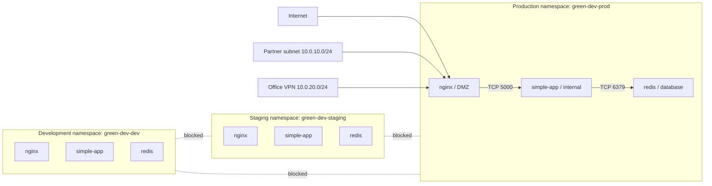

# Week 12: Network Design & Identity

This week extends the Week 11 Terraform stack with network segmentation and a
basic identity strategy. The implementation focuses on:

- `Core / Basic`: network architecture, CIDR planning, Kubernetes
  `NetworkPolicy`, security boundaries, and documented research
- `Intermediate`: office VPN design, partner exposure strategy, and policies
  that use ports and CIDR blocks
- `Advanced`: not implemented in this repository

The technical base for this week is the Week 11 application stack deployed in
three namespaces:

- `green-dev-dev`
- `green-dev-staging`
- `green-dev-prod`

## 1. Project Structure

```text
week-12-network/
|-- kubernetes/
|   |-- 00-default-deny.yml
|   |-- 01-env-isolation.yml
|   |-- 02-frontend-to-backend.yml
|   |-- 03-backend-to-redis.yml
|   |-- 04-allow-nginx-ingress.yml
|   `-- 05-allow-dns.yml
|-- QUESTIONS.md
|-- RESEARCH.md
|-- README.md
`-- verify_week12.sh
```

The supporting `prod` environment is defined in:

- [prod.tfvars](../week-11-iac/terraform/environments/prod.tfvars)

## 2. Architecture Overview

### 2.1 Network Zones

The design uses three logical zones:

- `DMZ`: the `nginx` frontend
- `Internal application zone`: the `simple-app` backend
- `Database zone`: `redis`

Only the minimum required traffic is allowed between those zones.

### 2.2 Environment Segmentation

The same stack exists in three namespaces:

- `green-dev-dev`
- `green-dev-staging`
- `green-dev-prod`

The namespaces represent:

- `development`
- `staging`
- `production`

Traffic between those environments is blocked by default.

### 2.3 High-Level Diagram



## 3. CIDR Plan

The network addressing plan is intentionally simple and scalable.

| Range | Purpose |
|---|---|
| `10.0.0.0/16` | Entire organization |
| `10.0.1.0/24` | Development environment |
| `10.0.2.0/24` | Staging environment |
| `10.0.3.0/24` | Production environment |
| `10.0.10.0/24` | External partners |
| `10.0.20.0/24` | Office-to-office VPN |

Why this subdivision:

- `/24` subnets are easy to reason about in a teaching/lab environment
- the ranges clearly separate environments
- partner access is isolated from internal application traffic
- the office VPN has its own space, which makes routing and firewall policy
  easier to explain

The Kubernetes namespaces are a logical segmentation layer inside the cluster,
while the CIDR plan documents the wider organizational design around the
cluster.

## 4. Security Boundaries

The project follows a Zero Trust model:

- start with `default deny`
- allow only the traffic required by the application
- isolate `dev`, `staging`, and `prod`
- allow partner access only to the intended public entry point

### 4.1 Allowed Traffic

| Source | Destination | Port | Why |
|---|---|---|---|
| `nginx` | `simple-app` | `5000/TCP` | reverse proxy path |
| `simple-app` | `redis` | `6379/TCP` | backend persistence |
| all pods | CoreDNS | `53/UDP`, `53/TCP` | service discovery |
| partner subnet `10.0.10.0/24` | `prod nginx` | `80`, `443` | controlled external access |
| office VPN `10.0.20.0/24` | `prod nginx` | `80`, `443` | secure office access |

### 4.2 Blocked Traffic

| Source | Destination | Why blocked |
|---|---|---|
| `dev` -> `staging` | cross-environment traffic | environment isolation |
| `staging` -> `prod` | cross-environment traffic | environment isolation |
| `prod` -> `dev` | cross-environment traffic | environment isolation |
| `nginx` -> `redis` | bypasses the backend | least privilege |
| arbitrary pods -> backend/database | no matching allow rule | default deny |
| internet/partners -> `dev` or `staging` | non-production exposure is not intended | safety boundary |

### 4.3 Preventing Misconfiguration

The repository reduces accidental mistakes in four ways:

- the policies rely on stable labels already produced by Week 11 Terraform:
  - `app=nginx|simple-app|redis`
  - `environment=dev|staging|prod`
- every environment has its own namespace
- a verification script checks both allowed and blocked paths
- the partner ingress rule is explicit and limited to CIDR blocks plus ports

## 5. Calico and Why It Matters

Kubernetes `NetworkPolicy` resources only have effect when the cluster uses a
network plugin that enforces them. In this repository, that plugin is
`Calico`.

For that reason, Minikube must be started with Calico before testing the week:

```bash
minikube delete
minikube start --driver=docker --container-runtime=docker --cni=calico
kubectl get pods -n kube-system | grep calico
```

If Calico is missing, the policies may exist as YAML objects but the traffic
restrictions would not actually be enforced.

## 6. Kubernetes NetworkPolicies

The policy set is intentionally small and composable.

| File | Role |
|---|---|
| [00-default-deny.yml](kubernetes/00-default-deny.yml) | default deny ingress and egress in all three environments |
| [01-env-isolation.yml](kubernetes/01-env-isolation.yml) | egress rules for `nginx -> simple-app` and `simple-app -> redis` per environment |
| [02-frontend-to-backend.yml](kubernetes/02-frontend-to-backend.yml) | ingress rules on the backend from `nginx` |
| [03-backend-to-redis.yml](kubernetes/03-backend-to-redis.yml) | ingress rules on `redis` from the backend |
| [04-allow-nginx-ingress.yml](kubernetes/04-allow-nginx-ingress.yml) | CIDR-based ingress to `prod nginx` for partners and office VPN |
| [05-allow-dns.yml](kubernetes/05-allow-dns.yml) | DNS egress to CoreDNS |

Important design choice:

- `dev`, `staging`, and `prod` all still use the Week 11 application layout
- however, only `prod` receives a dedicated external ingress rule
- `dev` and `staging` remain reachable for local lab work through Kubernetes
  service exposure, but the network policies block unintended broad ingress
  inside the cluster

## 7. Deployment Workflow

### 7.1 Deploy the Application Stack

This week depends on Week 11.

From [weeks/week-11-iac/terraform](../week-11-iac/terraform):

```bash
terraform init -backend=false

terraform workspace select dev
terraform apply -var-file ./environments/dev.tfvars -auto-approve

terraform workspace select staging
terraform apply -var-file ./environments/staging.tfvars -auto-approve

terraform workspace select prod
terraform apply -var-file ./environments/prod.tfvars -auto-approve
```

If `dev` or `staging` were stored in Terraform state from an older Minikube
cluster, use:

```bash
terraform destroy -var-file ./environments/dev.tfvars -auto-approve
terraform apply -var-file ./environments/dev.tfvars -auto-approve
```

and the same pattern for `staging`.

### 7.2 Apply the Policies

From [weeks/week-12-network](.):

```bash
kubectl apply -f kubernetes/
```

## 8. Verification

### 8.1 Manual Checks

Run the following checks from the repository root after deploying Week 11 and
applying the Week 12 policies.

1. Confirm that the three namespaces exist.

```bash
kubectl get ns
```

Expected result:

- `green-dev-dev` exists
- `green-dev-staging` exists
- `green-dev-prod` exists

2. Confirm that the workloads are running in all three environments.

```bash
kubectl get deploy,sts,svc -A
kubectl get pods -n green-dev-dev
kubectl get pods -n green-dev-staging
kubectl get pods -n green-dev-prod
```

Expected result:

- `nginx`, `simple-app`, and `redis` exist in `dev`, `staging`, and `prod`
- the pods are `Running`
- the deployments and StatefulSets are `Ready`

3. Confirm that the NetworkPolicies were created in each namespace.

```bash
kubectl get networkpolicy -A
```

Expected result:

- `default-deny-all` exists in `dev`, `staging`, and `prod`
- `allow-nginx-egress-to-backend` exists in `dev`, `staging`, and `prod`
- `allow-backend-egress-to-redis` exists in `dev`, `staging`, and `prod`
- `allow-backend-ingress-from-nginx` exists in `dev`, `staging`, and `prod`
- `allow-redis-ingress-from-backend` exists in `dev`, `staging`, and `prod`
- `allow-dns-egress` exists in `dev`, `staging`, and `prod`
- `allow-partner-and-office-ingress-to-nginx` exists in `prod`

4. Confirm the allowed application path in each environment.

```bash
kubectl exec -n green-dev-dev deploy/nginx -- curl -fsS http://simple-app:5000/health
kubectl exec -n green-dev-staging deploy/nginx -- curl -fsS http://simple-app:5000/health
kubectl exec -n green-dev-prod deploy/nginx -- curl -fsS http://simple-app:5000/health
```

Expected result:

- each command returns the backend health response successfully

5. Confirm that the backend can still reach Redis in each environment.

```bash
kubectl exec -n green-dev-dev deploy/simple-app -- python -c "import socket; s=socket.create_connection(('redis', 6379), 5); print('OK'); s.close()"
kubectl exec -n green-dev-staging deploy/simple-app -- python -c "import socket; s=socket.create_connection(('redis', 6379), 5); print('OK'); s.close()"
kubectl exec -n green-dev-prod deploy/simple-app -- python -c "import socket; s=socket.create_connection(('redis', 6379), 5); print('OK'); s.close()"
```

Expected result:

- each command prints `OK`

6. Confirm that DNS resolution still works after the policies are applied.

```bash
kubectl exec -n green-dev-dev deploy/simple-app -- python -c "import socket; print(socket.gethostbyname('redis'))"
kubectl exec -n green-dev-staging deploy/simple-app -- python -c "import socket; print(socket.gethostbyname('redis'))"
kubectl exec -n green-dev-prod deploy/simple-app -- python -c "import socket; print(socket.gethostbyname('redis'))"
```

Expected result:

- each command prints a non-empty cluster IP

7. Confirm that an application shortcut is blocked.

```bash
kubectl exec -n green-dev-dev deploy/nginx -- curl -s --max-time 3 http://redis:6379
```

Expected result:

- the command fails or times out
- `nginx` must not reach `redis` directly

8. Confirm cross-environment isolation.

```bash
kubectl exec -n green-dev-dev deploy/simple-app -- python -c "import socket; s=socket.create_connection(('simple-app.green-dev-staging.svc.cluster.local', 5000), 5); s.close()"
kubectl exec -n green-dev-staging deploy/simple-app -- python -c "import socket; s=socket.create_connection(('redis.green-dev-prod.svc.cluster.local', 6379), 5); s.close()"
kubectl exec -n green-dev-prod deploy/simple-app -- python -c "import socket; s=socket.create_connection(('simple-app.green-dev-dev.svc.cluster.local', 5000), 5); s.close()"
```

Expected result:

- all three commands fail
- `dev`, `staging`, and `prod` must not be able to reach each other directly

9. Confirm the partner and office CIDR rule in `prod`.

```bash
kubectl get networkpolicy allow-partner-and-office-ingress-to-nginx -n green-dev-prod -o jsonpath='{.spec.ingress[0].from[0].ipBlock.cidr}'; echo
kubectl get networkpolicy allow-partner-and-office-ingress-to-nginx -n green-dev-prod -o jsonpath='{.spec.ingress[0].from[1].ipBlock.cidr}'; echo
kubectl get networkpolicy allow-partner-and-office-ingress-to-nginx -n green-dev-prod -o jsonpath='{.spec.ingress[0].ports[0].port}'; echo
kubectl get networkpolicy allow-partner-and-office-ingress-to-nginx -n green-dev-prod -o jsonpath='{.spec.ingress[0].ports[1].port}'; echo
```

Expected result:

- the first CIDR is `10.0.10.0/24`
- the second CIDR is `10.0.20.0/24`
- the allowed ports are `80` and `443`

10. Optional browser check for the production entry point.

```bash
kubectl -n green-dev-prod port-forward service/nginx 8082:80
```

Then open:

```text
http://127.0.0.1:8082/api/
```

Expected result:

- the request reaches the production backend through `nginx`

### 8.2 Intermediate Validation Notes

The `Intermediate` part contains both:

- policy logic that can be tested directly in the lab
- network design decisions that are documented rather than fully simulated

What was tested directly:

- traffic restriction by port
- traffic restriction by role (`nginx`, `simple-app`, `redis`)
- cross-environment isolation
- the shape of the CIDR-based partner ingress rule

What is documented rather than fully simulated:

- a real office-to-office VPN tunnel
- a real client machine physically located inside `10.0.10.0/24`
- a real partner laptop reaching `prod` from that external subnet

In this lab, the CIDR-based partner rule is validated structurally through the
NetworkPolicy object itself. That is enough to prove the intended design, but
it is not the same thing as a real external network acceptance test.

### 8.3 Automated Check

The repository includes:

- [verify_week12.sh](verify_week12.sh)

Run it from the Week 12 directory:

```bash
chmod +x verify_week12.sh
./verify_week12.sh
```

The script validates:

- Minikube context
- Calico presence
- namespace existence
- policy existence
- allowed service paths
- DNS resolution
- cross-environment isolation
- partner ingress policy shape in `prod`

The current implementation has already been tested locally with Calico and
passed all checks.

## 9. Research Documents

To keep this README focused on architecture and implementation, the theoretical
material is split out into separate documents:

- [RESEARCH.md](RESEARCH.md)
  - DNS, DHCP, NTP
  - authentication vs authorization
  - LDAP, Active Directory, SSO
  - identity strategy recommendation for GreenDevCorp
- [QUESTIONS.md](QUESTIONS.md)
  - short-answer conceptual preparation

## 10. Identity Strategy Summary

The full reasoning is documented in [RESEARCH.md](RESEARCH.md), but the short
recommendation is:

- for a 20+ person company like GreenDevCorp, use a centralized identity
  provider with SSO and MFA
- keep application and infrastructure access tied to groups/roles rather than
  individual ad-hoc permissions
- avoid running self-managed LDAP as the default first step unless there is a
  clear operational reason

This fits the size of the company better than a fully self-hosted identity
stack and keeps onboarding, offboarding, and auditability manageable.

## 11. Intermediate Scope Covered

This repository covers the `Intermediate` level in these ways:

- office-to-office VPN is represented as a dedicated subnet:
  - `10.0.20.0/24`
- partner access is represented as a dedicated subnet:
  - `10.0.10.0/24`
- `prod` exposure uses a CIDR-based ingress rule
- policies restrict traffic by both:
  - role (`app=...`)
  - port (`5000`, `6379`, `53`, `80`, `443`)

## 12. Advanced Scope

The `Advanced` identity implementation was intentionally not implemented in
this repository.

That means:

- no OpenLDAP deployment
- no Kubernetes authentication against LDAP
- no test LDAP users inside the cluster

The README and research focus on architecture and recommendation instead of a
full LDAP lab.
