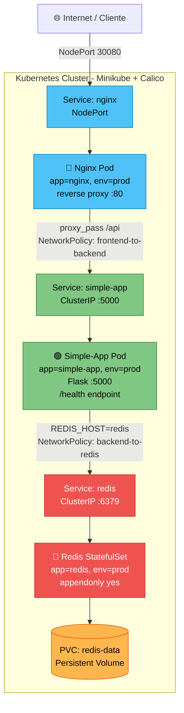

# Arquitectura del Sistema — GreenDevCorp

> Week 13 · Integración y Documentación Final  
> Autor: Gaizka Alonso Martínez

## Índice

- [Visión general](#visión-general)
- [Diagrama de arquitectura](#diagrama-de-arquitectura)
- [Componentes del sistema](#componentes-del-sistema)
- [Flujo de tráfico](#flujo-de-tráfico)
- [NetworkPolicies](#networkpolicies)
- [Persistencia de datos](#persistencia-de-datos)
- [Decisiones de diseño](#decisiones-de-diseño)

---

## Visión general

El sistema implementa una aplicación web de tres capas desplegada en Kubernetes (Minikube) con las siguientes características:

- **Entrada pública** a través de Nginx como reverse proxy
- **Lógica de negocio** en simple-app (Python/Flask)
- **Almacenamiento persistente** en Redis con StatefulSet y PVC
- **Seguridad de red** mediante NetworkPolicies (Calico)
- **Automatización** con Terraform para despliegue reproducible

## Diagrama de arquitectura

### Diagrama ASCII detallado

```
                        ┌─────────────────────────────────────────────┐
                        │              Kubernetes Cluster              │
                        │              (Minikube + Calico)             │
                        │                                             │
  ┌──────────┐          │  ┌─────────────────────────────────────┐    │
  │ Internet │──────────┼─▶│  Service: nginx (NodePort 30080)   │    │
  │ / Client │          │  │  type: NodePort                     │    │
  └──────────┘          │  └──────────────┬──────────────────────┘    │
                        │                 │                           │
                        │                 ▼                           │
                        │  ┌─────────────────────────────────────┐    │
                        │  │  Deployment: nginx                  │    │
                        │  │  image: nginx-gsx:latest            │    │
                        │  │  replicas: 1                        │    │
                        │  │  labels: app=nginx, env=prod        │    │
                        │  │  ports: 80                          │    │
                        │  │  resources: 128Mi / 0.25 CPU        │    │
                        │  │                                     │    │
                        │  │  default.conf:                      │    │
                        │  │    location /api {                  │    │
                        │  │      proxy_pass http://simple-app:5000/; │
                        │  │    }                                │    │
                        │  └──────────────┬──────────────────────┘    │
                        │                 │ NetworkPolicy:            │
                        │                 │ frontend-to-backend       │
                        │                 ▼                           │
                        │  ┌─────────────────────────────────────┐    │
                        │  │  Service: simple-app (ClusterIP)    │    │
                        │  │  port: 5000                         │    │
                        │  └──────────────┬──────────────────────┘    │
                        │                 │                           │
                        │                 ▼                           │
                        │  ┌─────────────────────────────────────┐    │
                        │  │  Deployment: simple-app             │    │
                        │  │  image: simple-app-gsx:latest       │    │
                        │  │  replicas: 1                        │    │
                        │  │  labels: app=simple-app, env=prod   │    │
                        │  │  ports: 5000                        │    │
                        │  │  resources: 256Mi / 0.50 CPU        │    │
                        │  │  env:                               │    │
                        │  │    REDIS_HOST=redis                 │    │
                        │  │    REDIS_PORT=6379                  │    │
                        │  │    APP_MESSAGE="Hello from K8s"     │    │
                        │  │  healthCheck: /health               │    │
                        │  └──────────────┬──────────────────────┘    │
                        │                 │ NetworkPolicy:            │
                        │                 │ backend-to-redis          │
                        │                 ▼                           │
                        │  ┌─────────────────────────────────────┐    │
                        │  │  Service: redis (ClusterIP)         │    │
                        │  │  port: 6379                         │    │
                        │  └──────────────┬──────────────────────┘    │
                        │                 │                           │
                        │                 ▼                           │
                        │  ┌─────────────────────────────────────┐    │
                        │  │  StatefulSet: redis                 │    │
                        │  │  image: redis:7-alpine              │    │
                        │  │  replicas: 1                        │    │
                        │  │  labels: app=redis, env=prod        │    │
                        │  │  ports: 6379                        │    │
                        │  │  command: redis-server --appendonly  │    │
                        │  │  volumeMount: /data → redis-pvc     │    │
                        │  │  resources: 128Mi / 0.25 CPU        │    │
                        │  └─────────────────────────────────────┘    │
                        │                                             │
                        └─────────────────────────────────────────────┘
```

### Diagrama Mermaid



## Componentes del sistema

### 1. Nginx (Frontend / Reverse Proxy)

| Propiedad | Valor |
|---|---|
| **Tipo de recurso** | Deployment |
| **Imagen** | `nginx-gsx:latest` (basada en `nginx:1.25-alpine` + config de Week 8) |
| **Puerto expuesto** | 80 (interno), NodePort 30080 (externo) |
| **Labels** | `app: nginx`, `env: prod` |
| **Réplicas** | 1 |
| **CPU** | request 0.10, limit 0.25 |
| **Memoria** | request 64Mi, limit 128Mi |
| **Dependencias** | simple-app (para proxy inverso) |

**Responsabilidades:**
- Punto de entrada público del sistema
- Servir contenido estático
- Proxy inverso: redirige `/api` → `http://simple-app:5000/`
- Health check HTTP en `/`

### 2. Simple-App (Backend)

| Propiedad | Valor |
|---|---|
| **Tipo de recurso** | Deployment |
| **Imagen** | `simple-app-gsx:latest` (Python 3.11 + Flask) |
| **Puerto** | 5000 (ClusterIP) |
| **Labels** | `app: simple-app`, `env: prod` |
| **Réplicas** | 1 |
| **CPU** | request 0.20, limit 0.50 |
| **Memoria** | request 128Mi, limit 256Mi |
| **Variables de entorno** | `APP_MESSAGE`, `PORT`, `REDIS_HOST`, `REDIS_PORT` |
| **Dependencias** | Redis |

**Responsabilidades:**
- Lógica de negocio de la aplicación
- Endpoint principal `/` (devuelve mensaje + contador de visitas)
- Endpoint de salud `/health` (verifica conexión a Redis)
- Lee/escribe el contador de visitas en Redis
- Toda la configuración se inyecta por variables de entorno (sin hardcoding)

### 3. Redis (Base de datos)

| Propiedad | Valor |
|---|---|
| **Tipo de recurso** | StatefulSet |
| **Imagen** | `redis:7-alpine` |
| **Puerto** | 6379 (ClusterIP) |
| **Labels** | `app: redis`, `env: prod` |
| **Réplicas** | 1 |
| **CPU** | request 0.10, limit 0.25 |
| **Memoria** | request 64Mi, limit 128Mi |
| **Persistencia** | PVC montado en `/data`, modo `appendonly yes` |
| **Health check** | `redis-cli ping` → `PONG` |

**Responsabilidades:**
- Almacenar el contador de visitas del backend
- Persistir datos en disco (append-only file)
- Sobrevivir a reinicios de pod gracias al PVC

**¿Por qué StatefulSet y no Deployment?**
Redis requiere identidad de red estable y almacenamiento persistente asociado a cada réplica. StatefulSet garantiza que el PVC se re-asocia al mismo pod tras un reinicio, evitando pérdida de datos.

## Flujo de tráfico

```
1. Cliente envía HTTP request → http://<minikube-ip>:30080/api
2. Service nginx (NodePort) → recibe en puerto 30080
3. Pod nginx → recibe en puerto 80
4. Nginx lee default.conf → location /api → proxy_pass http://simple-app:5000/
5. DNS interno de K8s resuelve "simple-app" → ClusterIP del Service
6. Service simple-app (ClusterIP) → enruta al pod simple-app:5000
7. Pod simple-app → conecta a redis:6379 (resolución DNS interna)
8. Service redis (ClusterIP) → enruta al pod redis:6379
9. Redis incrementa y devuelve el contador → simple-app genera respuesta
10. Respuesta viaja de vuelta: Redis → App → Nginx → Cliente
```

### Resolución de nombres DNS

Todos los servicios se descubren por nombre DNS dentro del clúster:

- `nginx` → Service ClusterIP de Nginx
- `simple-app` → Service ClusterIP del backend
- `redis` → Service ClusterIP de Redis

Kubernetes proporciona DNS automático a través de CoreDNS. No se usan IPs fijas en ningún momento.

## NetworkPolicies

El clúster usa Calico como CNI para soportar NetworkPolicies. Se implementa un modelo de **deny-all por defecto** con excepciones explícitas:

| Fichero | Descripción | Permite |
|---|---|---|
| `00-default-deny.yml` | Deniega todo tráfico ingress/egress en namespace prod | Nada (base restrictiva) |
| `02-frontend-to-backend.yml` | Nginx puede hablar con simple-app | `app=nginx` → `app=simple-app` puerto 5000 |
| `03-backend-to-redis.yml` | Simple-app puede hablar con Redis | `app=simple-app` → `app=redis` puerto 6379 |
| `04-allow-nginx-ingress.yml` | Tráfico externo puede llegar a Nginx | Cualquier origen → `app=nginx` puerto 80 |
| `05-allow-dns.yml` | Todos los pods pueden resolver DNS | Cualquier pod → CoreDNS puerto 53 (TCP/UDP) |

### Principio de mínimo privilegio

- Redis **nunca** es accesible desde Internet ni desde Nginx directamente.
- Simple-app **no** es accesible desde Internet directamente.
- Solo Nginx expone un puerto al exterior.
- Si un pod con label `env=dev` intenta acceder a `simple-app`, la NetworkPolicy lo bloquea.

## Persistencia de datos

| Volumen | Tipo | Montaje | Propósito |
|---|---|---|---|
| `redis-data` | PVC (PersistentVolumeClaim) | `/data` en Redis | Almacena AOF de Redis, persiste el contador de visitas |
| `app-data` | Named volume (Compose) | `/data` en simple-app | Disponible para extensiones futuras del backend |

### Comportamiento de persistencia

- `kubectl delete pod redis-0` → el pod se recrea y el PVC se re-monta → datos intactos
- `kubectl delete pvc redis-data` → datos perdidos permanentemente
- En Compose: `docker compose down` conserva volúmenes; `docker compose down -v` los elimina

## Decisiones de diseño

| Decisión | Justificación |
|---|---|
| Nginx como reverse proxy | Separa la entrada pública del backend, permite SSL termination futuro, caching, rate limiting |
| StatefulSet para Redis | Garantiza identidad estable y PVC asociado, correcto para bases de datos |
| Deployment para nginx y simple-app | Son stateless, se pueden escalar horizontalmente sin problemas |
| Calico como CNI | Soporte completo de NetworkPolicies, ampliamente usado en producción |
| Variables de entorno (no ConfigMap) | Simplicidad para el stack actual; en producción se usarían ConfigMaps y Secrets |
| `appendonly yes` en Redis | Mayor durabilidad de datos vs. RDB snapshots, aceptable para este volumen de escritura |
| NodePort (no Ingress) | Suficiente para Minikube; en producción se usaría Ingress con TLS |
